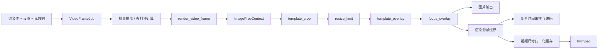

# SuperBirdStamp 架构与开发定位

本文按当前代码说明功能入口、状态归属和数据流。行为约束与验证要求以仓库根目录的 [AGENTS.md](../../AGENTS.md) 和 [AI_CODING_RULES.md](../../ai_rules/AI_CODING_RULES.md) 为准；环境与构建入口见 [仓库 README](../../README.md)。移动模块或改变处理流程时，应同步更新这里的链接和边界说明。

## 1. 启动入口与模块边界

| 入口或模块 | 职责与关键符号 |
| --- | --- |
| [entry.py](../entry.py) | `main` 补齐仓库导入路径，开发环境优先重启到仓库 `.venv`，再进入应用入口。 |
| [main.py](../main.py) | `main` 配置启动日志、处理文件参数和已有实例转发，延迟导入 GUI。 |
| [gui/editor.py](../birdstamp/gui/editor.py) | `launch_gui` 创建应用、窗口、FileOpen 处理和单实例接收器；窗口显示后安排启动恢复与文件导入。`aboutToQuit` 停止接收器并关闭 ExifTool 常驻进程。 |
| [cli.py](../birdstamp/cli.py) / [__main__.py](../birdstamp/__main__.py) | Typer 命令 `render`、`inspect`、`inspect-auto-proxy`、`init-config`、`gui`。适合批处理、字段路由诊断和无窗口验证。 |
| [gui/editor_core.py](../birdstamp/gui/editor_core.py) / [decoders/image_decoder.py](../birdstamp/decoders/image_decoder.py) | 裁切、缩放等图像计算与原图/预览解码。部分可复用计算目前仍位于 `gui` 包内，不能仅凭目录名判断是否依赖窗口。 |
| [image_pipeline](../birdstamp/image_pipeline/__init__.py) / [export_stage](../birdstamp/export_stage/__init__.py) | 处理阶段、单帧任务、批量预计算、帧缓存及视频编码。 |
| [app_common](../../app_common/__init__.py) | 两应用共用的格式定义、元数据/XMP/report.db、文件列表、预览画布、进程与应用间文件传递能力。 |

当前 CLI `render` 直接组合解码、裁切/缩放和模板叠加，并未通过 `VideoFrameJob` 运行 GUI 导出阶段管线。新增渲染能力时，需要明确是否同步到该命令，不能假设 GUI 改动已自动覆盖 CLI。

## 2. 编辑器状态与线程归属

主窗口 [BirdStampEditorWindow](../birdstamp/gui/editor.py) 组合四个 mixin：

| 组成 | 主要职责 |
| --- | --- |
| [_BirdStampCropMixin](../birdstamp/gui/editor_crop_calculator.py) | 裁切框、中心和边距等交互计算。 |
| [_BirdStampRendererMixin](../birdstamp/gui/editor_renderer.py) | 设置快照、原图/预览缓存、鸟检测结果和预览绘制。 |
| [_BirdStampExporterMixin](../birdstamp/gui/editor_exporter.py) | 图片/GIF 导出的目标分配、作业调度、进度与错误展示。 |
| [_BirdStampWorkspaceMixin](../birdstamp/gui/editor_workspace.py) | 工作区序列化、增量恢复、自动保存及恢复期间的保存门控。 |

窗口保存显式状态：`current_path` 指向源文件；`current_source_image` 可为受限尺寸的预览解码结果，完整尺寸另存于 `current_source_full_size`；原始元数据、模板上下文和 `PhotoInfo` 分别保存在当前照片状态中。`photo_render_overrides` 保存逐图设置，全局导出设置另行合并。不要用预览 JPEG 的路径或像素尺寸替代原图的元数据、裁切坐标或导出输入。

[PhotoListWidget](../birdstamp/gui/editor_photo_list.py) 是共享 `FileListPanel` 的编辑器适配层，内部保留 `QTreeWidget` 和既有列表 API。它沿用原生方向键选择，未开启 SuperViewer 的应用定时器连续播放行为。导入发现结果通过队列和定时器分批加入 UI，避免一次插入大量行。

| 后台工作 | 所有者、接收与结束条件 |
| --- | --- |
| [editor.py](../birdstamp/gui/editor.py) 的 `_PhotoInputDiscoveryWorker` | 窗口保存活动和待结束 worker 引用。`finished_discovery` 仅表示业务结果完成；直到真实 `QThread.finished` 才移除待结束引用。停止或等待超时均不能提前释放线程。已退出活动集合的旧结果不再导入列表。 |
| [EditorPreviewDecodeWorker](../birdstamp/gui/editor_preview_decode_worker.py) | 窗口发起解码，通过请求 token 和路径验证结果，快速切图后忽略过期回调。 |
| [EditorPhotoListMetadataLoader](../birdstamp/gui/editor_photo_metadata_loader.py) | 分块读取元数据，窗口增量应用列表和当前照片数据；停止使用协作中断。 |
| [BirdDetectWorker](../birdstamp/gui/bird_detect_worker.py) | 接收独立图像副本，在后台识别并在结束时关闭副本；渲染 mixin 按源图签名接收结果。 |
| [VideoExportWorker](../birdstamp/gui/editor_video_panel.py) | 窗口持有线程；`VideoExportJobSeed` 先在 GUI 线程快照 Qt 状态，worker 的 `_prepare_jobs` 补齐元数据与渲染作业。取消通过事件传入导出核心。 |

`BirdStampEditorWindow.closeEvent` 在视频导出仍运行时拒绝关闭并提示先停止；其他工作采用协作停止。只要预览、检测、元数据或发现线程仍在运行，窗口忽略本次关闭并通过定时器重试，不阻塞 GUI 等待发现线程。全部结束后才关闭工作区自动保存并接受关闭。修改这条路径时，应测试“业务完成信号已发出但线程尚未返回”的窗口期。

## 3. 元数据与模板 provider

[template_context.py](../birdstamp/gui/template_context.py) 是模板字段的主要定位入口：

- `PhotoInfo` 保存源文件、sidecar 路径与原始元数据；`EditorPhotoInfo` 加入归一化裁切框和列表行号。
- `TemplateContextProvider` 定义字段与取值接口，子类注册到 provider registry；`TemplateContextField` 定义规范字段及别名。
- `AutoProxyTemplateContextProvider` 按 **Exif → FromFile → ReportDB → Editor** 查找首个非缺失值。Exif provider 内部先处理 XMP sidecar 优先级，因此这里的 Exif 不是“原图内嵌 EXIF 永远优先”。
- [template_context_routes.json](../config/template_context_routes.json) 配置字段候选路由，路由仍按固定 provider 优先级排序。`inspect_candidates` 可返回候选来源和值；CLI `inspect-auto-proxy` 用于诊断为何命中某来源。
- `build_template_context` 按低到高优先级合并上下文字典，`build_template_context_provider` 创建单字段 provider。模板编辑器通过 `iter_template_context_selector_provider_classes` 主要展示统一 AutoProxy 字段和独立 Editor 字段，兼容旧模板的来源定义。

`set_report_db_row_resolver` 将编辑器的 report.db 查询能力注入模板层。report.db 是只读兼容输入；用户元数据编辑通过共享 [PhotoMetaDataXMP](../../app_common/exif_io/photo_meta.py) 写同名 XMP sidecar，不能写回原图或数据库。`XMP-superpicky:*` 自定义字段和标准 XMP 字段共同参与兼容取值。sidecar 读取缓存以路径、大小和纳秒修改时间为签名，文件元数据缓存也包含 sidecar 签名，修改或删除 sidecar 后需要得到新值。

[editor_template.py](../birdstamp/gui/editor_template.py) 负责模板目录、默认模板初始化、JSON 规范化和 `render_template_overlay` 绘制；[editor_template_dialog.py](../birdstamp/gui/editor_template_dialog.py) 负责编辑 UI。字体与中文回退绘制见 [render/typography.py](../birdstamp/render/typography.py)。CLI 的标准化元数据模型则位于 [models.py](../birdstamp/models.py) 与 [meta/normalize.py](../birdstamp/meta/normalize.py)。

## 4. 预览与导出图像管线



图中是默认阶段顺序。实际构建由 [build_default_image_proc_pipeline](../birdstamp/export_stage/pipeline.py) 和 [normalize_pipeline_stage_order](../birdstamp/export_stage/core.py) 处理设置；裁切阶段固定在首位，其余阶段按规范化顺序执行。导出阶段选择与图像处理阶段是两个概念。

| 抽象 | 数据与扩展边界 |
| --- | --- |
| [VideoFrameJob](../birdstamp/export_stage/video_frame_job.py) | 单帧输入快照：源路径、设置、原始元数据、模板上下文、照片信息及可选预计算裁切。名称含 Video，但图片/GIF 渲染也复用它。GUI 导出作业不携带预览位图，由核心重新解码原图。 |
| [ImageProcContext](../birdstamp/image_pipeline/image_proc_context.py) | 阶段间共享图像、源尺寸、裁切框/边距、批量输入、元数据、模板路径、预计算结果和带锁的鸟框缓存。 |
| [ImageProcStage](../birdstamp/image_pipeline/image_proc_stage/image_proc_stage.py) | `process` 处理单帧；`process_batch` 提供批量入口；阶段描述与选项负责 UI 元数据及启用条件。 |
| [ImageProcPipeline](../birdstamp/image_pipeline/image_proc_pipeline.py) | 按顺序执行启用阶段，提供单帧和批量入口。 |
| [ImageProcExportStage](../birdstamp/image_pipeline/image_proc_export_stage.py) | PNG/GIF/Video 终端选择的描述基类。其 `process` 本身不编码文件，实际编码由 exporter/core 调度。 |

[export_stage/core.py](../birdstamp/export_stage/core.py) 的 `render_video_frame` 构造上下文并运行阶段管线。`prepare_uniform_auto_crop_plans` 在整批图像间预计算统一裁切；去抖策略通过 [resolve_dejitter_strategy](../birdstamp/image_dejitter/strategy_registry.py) 选择中值中心或参考区域策略。改变这些批量计算时，要同时检查其输出是否进入缓存签名。

预览由 [editor_renderer.py](../birdstamp/gui/editor_renderer.py) 的 `render_preview`、`_render_preview_pipeline_image` 适配相同的阶段顺序和设置，但保留裁切外画布以供编辑，不直接把最终裁切位图作为交互画布。模板要与裁切区域对齐，焦点框也要经过相同坐标变换。[editor_preview_canvas.py](../birdstamp/gui/editor_preview_canvas.py) 承接交互显示和网格叠加。

渲染 mixin 的完整解码缓存和预览缓存分开管理，以源路径/大小/修改时间签名失效，各限制为少量图像并关闭被淘汰图像。预览解码默认限制长边 2048，显示位图另有像素预算；这些限制只影响交互，不能下传为导出尺寸。

## 5. 图片、GIF、视频导出与缓存

### 图片和批量作业

[editor_exporter.py](../birdstamp/gui/editor_exporter.py) 的 `export_current` / `export_all` 根据终端选择调度图片或 GIF；图片进入 `_export_render_jobs_to_images`。单图和批量导出由 GUI 编排，批量图像任务使用线程池并限制在途任务；GUI 在进度更新处处理事件，因此不能把整个图片/GIF 流程描述成独立的后台 QThread。

`_build_batch_image_targets` 在启动并行写入前分配所有文件名：使用 NFC 规范化加 `casefold` 判断本批同名目标，依次追加 `_2`、`_3`。这避免不同目录的 `a.jpg`、`A.jpg` 或 Unicode 等价名称写到同一目标；它解决本批目标互撞，不提供跨进程文件锁。并行度复用导出核心的 CPU/图像像素内存预算。

### 两级帧缓存和视频生命周期

[export_frame_cache.py](../birdstamp/export_frame_cache.py) 的 `FrameCachePlan` / `create_frame_cache_plan` 管理帧目录和 manifest：

| 缓存 | 内容与复用条件 |
| --- | --- |
| `rendered_source_frames` | 完成裁切、模板和焦点处理的 RGB 源帧。桶由全局导出设置与版本区分；逐帧记录源文件签名、渲染设置、元数据/模板上下文、照片信息和模板内容签名。 |
| `video_frames` | 按视频目标尺寸和背景归一化后的 PNG 帧，宽高满足编码的偶数要求。桶关联源帧桶、目标尺寸和背景；只改 FPS 或编码器通常可复用已渲染帧。 |

保留模式使用输出目录下的 `birdstamp_export_cache/<类型>/<桶>/frames` 与 manifest；临时模式在输出目录创建独立临时目录。`dirty_path_keys` 强制相关源图重渲染，manifest 验证命中条件。GIF 的 `_ensure_gif_frame_cache` 也使用渲染源帧缓存；视频由 `_ensure_source_frame_cache`、`_ensure_video_frame_cache` 分两步准备。

[export_video](../birdstamp/export_stage/core.py) 在每个缓存目录创建后立即接管所有权，不能等准备函数成功返回后才记录目录。成功时先在工作目录编码，再用 `os.replace` 放到最终目标；普通异常清理未完成视频，并按 `preserve_temp_files` 决定是否保留帧缓存。即使异常发生在首帧或 manifest 准备期间，临时目录也有清理责任方。

取消与普通失败的语义不同：取消会保留已完成帧，并通过 [VideoExportCancelledError](../birdstamp/export_stage/video_export_cancelled_error.py) 返回保留目录；已经有规范化视频帧时尝试生成部分视频，只有源帧时报告源帧目录。调用方应展示恢复路径。创建线程池的工作线程在 `finally` 中负责停止提交和等待池结束。

`_run_ffmpeg_command` 管理 FFmpeg 子进程，stderr 写临时文件以避免管道填满阻塞，失败时读取有限尾部信息；取消先终止，必要时强制结束并等待退出。窗口、worker、线程池与子进程分别有明确所有者，不能仅停止进度 UI 就视为任务已结束。

### GIF 时长与高 FPS 语义

[gif_export.py](../birdstamp/gif_export.py) 的 `build_gif_frame_timing` 先生成 `GifFrameTiming`，`export_gif` 再按计划采样、统一尺寸并编码主文件及缩放变体。

- GIF 时间粒度为 10 ms。请求不超过 100 FPS 时保留所有输入帧，按累计时间量化每帧时长，避免逐帧取整累计误差；例如 24 FPS 使用不同的 10 ms 倍数时长组合。
- [GifExportPanel](../birdstamp/gui/editor_gif_panel.py) 保留 1–240 FPS 输入。超过 100 FPS 时按原始总时长采样到 100 FPS，部分输入帧不会进入 GIF，编码帧数会改变，不能再假设一张输入图对应一帧 GIF。
- 总时长通常与请求时长相差不超过 5 ms；非空片段最少是一帧 10 ms，极短片段受此下限约束。所有帧时长均非零，主输出与缩放变体复用同一时间计划。
- `GifExportProgress` 的 `current` / `total` 使用计划编码帧数，另有 `input_frame_count`、`encoded_frame_count`、`requested_fps`、`effective_fps`、`duration_ms` 和变体序号。非 GUI 调用方也应展示实际 FPS 与时长；GUI 的进度和完成摘要已展示这些信息。

当前 Pillow GIF 编码会在内存中保留一个变体的全部采样帧，尚非流式编码。编码器可能合并相同帧，播放器也可能施加自身最小时长；上述进度表达导出的时间计划，不能用来假设文件必然包含同等数量的独立帧记录或所有播放器具有相同播放策略。

## 6. 工作区、自动保存与配置

[workspace.py](../birdstamp/workspace.py) 是不依赖窗口的 JSON 存取层。`serialize_workspace_path` 保存相对/绝对路径信息，`resolve_workspace_path` 优先使用可用的相对路径，再回退绝对路径。`read_workspace_json` 校验格式；`write_workspace_json` 在同目录写临时文件、flush/fsync 后原子替换，失败清理临时文件。

[editor_workspace.py](../birdstamp/gui/editor_workspace.py) 把 UI 状态映射为工作区：照片顺序与逐图覆盖、report.db 路径、当前/选中照片、排序、全局设置、导出与预览状态。恢复是异步流程：

1. `_restore_startup_workspace` 优先尝试自动保存，再尝试上次工作区。
2. `_restore_workspace_payload` 安装恢复上下文和待恢复队列；定时器驱动 `_process_workspace_restore_photo_batch`，按数量与耗时预算添加照片。
3. `_finish_workspace_restore_payload` 完成排序、选中项、元数据加载和剩余 UI 状态，清除恢复上下文后才重新允许保存。
4. 恢复期间，自动保存和 `_save_workspace_to_path` 手动保存都受门控。中途关闭由 `_shutdown_workspace_autosave` 保留上一次完整 autosave、停止恢复定时器并屏蔽晚到回调，不能用半恢复的列表覆盖原工作区。

[config.py](../birdstamp/config.py) 区分只读资源与可写状态：`resolve_bundled_path` 定位内置资源；`get_user_data_dir` 在开发模式返回应用目录，打包后返回平台用户目录；`get_config_path` 返回其 `Config/config.yaml`。模板经 [template_directory](../birdstamp/gui/editor_template.py) 进入同级 `templates`，运行状态和 `editor_autosave.birdstamp-workspace.json` 也位于配置目录。默认编辑选项来自 [editor_options.json](../config/editor_options.json)。自动保存、导出状态和用户路径不应打包为发行默认值。

## 7. 按功能定位入口与回归

| 要修改的功能 | 首先定位 | 主要回归入口 |
| --- | --- | --- |
| 新格式、原图/预览解码 | [image_decoder.py](../birdstamp/decoders/image_decoder.py)、共享 [image_formats.py](../../app_common/image_formats.py) | [test_decode_image_for_preview.py](../tests/test_decode_image_for_preview.py)、[test_raw_decoder.py](../tests/test_raw_decoder.py)、[test_psd_decoder.py](../tests/test_psd_decoder.py) |
| 导入、切图、关闭线程 | [editor.py](../birdstamp/gui/editor.py) 及 worker | [test_editor_selection_preview.py](../tests/test_editor_selection_preview.py)、[test_editor_discovery_shutdown.py](../tests/test_editor_discovery_shutdown.py)、[test_editor_worker_lifecycle.py](../tests/test_editor_worker_lifecycle.py) |
| 列表排序、方向键兼容 | [editor_photo_list.py](../birdstamp/gui/editor_photo_list.py) | [test_editor_photo_list_sort.py](../tests/test_editor_photo_list_sort.py)、[test_editor_photo_list_navigation_compat.py](../tests/test_editor_photo_list_navigation_compat.py) |
| 模板字段、XMP 优先级、缓存失效 | [template_context.py](../birdstamp/gui/template_context.py) | [test_template_context_report_db.py](../tests/test_template_context_report_db.py)、[test_template_context_cache_invalidation.py](../tests/test_template_context_cache_invalidation.py) |
| 裁切、阶段顺序、去抖 | [pipeline.py](../birdstamp/export_stage/pipeline.py)、[editor_renderer.py](../birdstamp/gui/editor_renderer.py) | [test_image_pipeline.py](../tests/test_image_pipeline.py)、[test_video_export_uniform_crop.py](../tests/test_video_export_uniform_crop.py)、[test_video_export_dejitter.py](../tests/test_video_export_dejitter.py)、[test_editor_preview_grid.py](../tests/test_editor_preview_grid.py) |
| 图片目标名、并行写出 | [editor_exporter.py](../birdstamp/gui/editor_exporter.py) | [test_image_export_targets.py](../tests/test_image_export_targets.py) |
| GIF 时长、采样、缩放变体 | [gif_export.py](../birdstamp/gif_export.py)、[editor_gif_panel.py](../birdstamp/gui/editor_gif_panel.py) | [test_gif_export.py](../tests/test_gif_export.py)、[test_gif_timing.py](../tests/test_gif_timing.py) |
| 视频编码、帧缓存、取消 | [export_stage/core.py](../birdstamp/export_stage/core.py)、[editor_video_panel.py](../birdstamp/gui/editor_video_panel.py) | [test_video_export.py](../tests/test_video_export.py)、[test_video_export_cleanup.py](../tests/test_video_export_cleanup.py)、[test_editor_video_worker.py](../tests/test_editor_video_worker.py) |
| 工作区恢复与配置路径 | [editor_workspace.py](../birdstamp/gui/editor_workspace.py)、[workspace.py](../birdstamp/workspace.py) | [test_workspace.py](../tests/test_workspace.py)、[test_workspace_restore_autosave.py](../tests/test_workspace_restore_autosave.py)、[test_config_paths.py](../tests/test_config_paths.py) |

## 8. 扩展步骤与验证方式

新增处理阶段时，先实现 `ImageProcStage`，提供选项/描述并接入阶段注册与顺序规范化；随后检查设置快照、逐图覆盖、工作区往返和缓存签名。同步实现预览的坐标/画布语义，最后检查 CLI 是否需要新增入口。阶段测试之外，应比较真实输出和预览裁切区域。

新增模板字段时，先定义规范字段、别名和 provider 候选，再更新路由与编辑器选项。使用来源冲突样本验证 XMP、文件、report.db 与 Editor 的优先级，覆盖中文、数值零和 sidecar 修改/删除后的缓存失效。需要写入时使用共享 XMP 接口并实际读回。

新增导出方式时，把编码选项、验证、进度和取消放在无窗口核心，GUI 只快照状态和展示结果。先定义输出/临时资源所有者，再接入线程和 UI；覆盖创建后立即失败、半途取消、已有目标文件与 worker 关闭窗口期。性能优化优先检查有界并发、可复用帧和重复解码，不把更多任务一次性堆入队列。

测试从仓库根目录使用共享虚拟环境；[pytest.ini](../../pytest.ini) 已提供仓库和 BirdStamp 导入路径。Windows PowerShell 示例：

```powershell
$env:QT_QPA_PLATFORM = 'offscreen'
.\.venv\Scripts\python.exe -m pytest SuperBirdStamp/tests -q
.\.venv\Scripts\python.exe -m pytest -q
```

macOS 使用 `.venv/bin/python3` 执行相同的 `-m pytest` 参数。先运行受影响的专项测试，再按根规则运行完整回归；改 Python 还需对实际变更文件执行 `-m py_compile`。涉及共享格式、XMP 或列表行为时，连同相关 `app_common/tests` 和 SuperViewer 受保护流程一起验证。

GUI 测试必须在构造窗口前将 `birdstamp.config.get_user_data_dir` patch 到临时目录，并按需隔离缓存。构造后才禁用保存不能防止启动读取或初始化真实配置。使用进程级强引用保留 `QApplication`，按实际状态/定时器/线程完成条件等待，不能只增加固定 sleep。自动保存、模板与导出状态的真实用户文件不应成为测试输入或清理对象；离屏测试也不替代 Windows/macOS 打包后启动验证。
