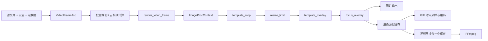

# SuperBirdStamp 架构与开发定位

本文按当前代码说明功能入口、状态归属和数据流。行为约束与验证要求以仓库根目录的 [AGENTS.md](../../AGENTS.md) 和 [AI_CODING_RULES.md](../../ai_rules/AI_CODING_RULES.md) 为准；环境与构建入口见 [仓库 README](../../README.md)。移动模块或改变处理流程时，应同步更新这里的链接和边界说明。

## 1. 启动入口与模块边界

| 入口或模块 | 职责与关键符号 |
| --- | --- |
| [entry.py](../entry.py) | `main` 补齐仓库导入路径，开发环境优先重启到仓库 `.venv`，再进入应用入口。 |
| [main.py](../main.py) | `main` 配置启动日志、处理文件参数和已有实例转发，延迟导入 GUI。 |
| [gui/editor.py](../birdstamp/gui/editor.py) | `launch_gui` 创建应用、窗口、FileOpen 处理和单实例接收器；窗口显示后安排启动恢复与文件导入。`closeEvent` 先取消元数据读取、在后台关闭 ExifTool，并等实际线程结束；`aboutToQuit` 停止接收器并再次执行幂等清理。 |
| [cli.py](../birdstamp/cli.py) / [__main__.py](../birdstamp/__main__.py) | Typer 命令 `render`、`inspect`、`inspect-auto-proxy`、`init-config`、`gui`。适合批处理、字段路由诊断和无窗口验证。 |
| [gui/editor_core.py](../birdstamp/gui/editor_core.py) / [decoders/image_decoder.py](../birdstamp/decoders/image_decoder.py) | 裁切、缩放等图像计算与原图/预览解码。部分可复用计算目前仍位于 `gui` 包内，不能仅凭目录名判断是否依赖窗口。 |
| [image_pipeline](../birdstamp/image_pipeline/__init__.py) / [export_stage](../birdstamp/export_stage/__init__.py) | 处理阶段、单帧任务、批量预计算、帧缓存及视频编码。 |
| [app_common](../../app_common/__init__.py) | 两应用共用的格式定义、元数据/XMP/report.db、文件列表、预览画布、进程与应用间文件传递能力。 |

当前 CLI `render` 直接组合解码、裁切/缩放和模板叠加，并未通过 `VideoFrameJob` 运行 GUI 导出阶段管线。新增渲染能力时，需要明确是否同步到该命令，不能假设 GUI 改动已自动覆盖 CLI。

应用身份由根 [app_metadata.json](../../app_metadata.json) 经 [load_app_identity](../../app_identity.py) 读取，包入口导出 `APP_INFO` / `__version__`，窗口标题和 Qt 应用名使用同一对象。应用自己的 [about.cfg](../about.cfg) 仅管理 About 内容与图片，共享 [config.py](../../app_common/about_dialog/config.py) 处理覆盖和路径，[AboutDialog](../../app_common/about_dialog/dialog.py) 负责屏幕边界、自适应换行和滚动。只读启动检查 [about_diagnostics.py](../../about_diagnostics.py) 通过 `entry.py --check-about` 调用应用实际配置入口，不构造主窗口或恢复工作区。

Hot-received photos switch the B preview from result view to source/edit view before the import queue starts, including when the photo list is empty. The IPC receiver reports transfer completion before the import callback, so a late transfer event cannot replace the final import status. File > New Workspace (Ctrl+N) reuses the empty workspace restore path and the editor defaults captured before startup workspace restoration; it clears photos, report databases, sequence results and workspace settings, then returns to source/edit view. The previous named workspace is not overwritten by this action.

## 2. 编辑器状态与线程归属

主窗口 [BirdStampEditorWindow](../birdstamp/gui/editor.py) 组合六个 mixin：

| 组成 | 主要职责 |
| --- | --- |
| [_BirdStampCropMixin](../birdstamp/gui/editor_crop_calculator.py) | 裁切框、中心和边距等交互计算。 |
| [_BirdStampRendererMixin](../birdstamp/gui/editor_renderer.py) | 设置快照、原图/预览缓存、鸟检测结果和预览绘制。 |
| [_BirdStampExporterMixin](../birdstamp/gui/editor_exporter.py) | 图片/GIF 导出的目标分配、作业调度、进度与错误展示。 |
| [_BirdStampDejitterMixin](../birdstamp/gui/editor_dejitter.py) | 导出组的去抖动标签页、原生编辑/成片 Tab、整组分析签名与快/清晰两级有界成片缓存、共享画布辅助层映射。 |
| [ABPreview](../birdstamp/gui/editor_ab_preview.py) | 独立 A/B 对照：预览工具栏「显示裁切效果」前的分屏图标开关带悬停提示；点击激活侧接收照片列表选择，原图/成片独立切换及可选视野联动；A 保持单 worker 所有权，B 保留原编辑上下文。 |
| [SequenceTransport](../birdstamp/gui/editor_sequence_transport.py) | 原图/成片共用播放条、帧率、循环和缩略图条；A/B 每侧按钮激活本侧，播放只切换该侧。照片列表变化后，[SourceQuickLoader](../birdstamp/gui/editor_source_quick_loader.py) 用共享 action 池准备全列表 512 长边小图，压缩结果写入用户配置目录 `config/cache/source_preview`；内存只保留播放附近的 64 MiB 帧。原图播放等待全列表完成，损坏图跳过并显示数量；意外缓存缺帧时停在当前画面等待补读。停播后升级清晰帧。普通编辑页方向键首次按下用小图，长按由精确定时器驱动，物理松键提交最终清晰预览。 |
| [_BirdStampReferenceTrackingMixin](../birdstamp/gui/editor_reference_tracking.py) | 多参考区预处理、结果签名与失效、切图跟踪预览及工作线程所有权。 |
| [_BirdStampWorkspaceMixin](../birdstamp/gui/editor_workspace.py) | 工作区序列化、增量恢复、自动保存、文件菜单最近工作区记录及恢复期间的保存门控。最近列表保存在用户目录的 `editor_export_state.json`，只记录成功加载或手动保存的工作区；自动保存不进入列表。 |

窗口保存显式状态：`current_path` 指向源文件；`current_source_image` 可为受限尺寸的预览解码结果，完整尺寸另存于 `current_source_full_size`；原始元数据、模板上下文和 `PhotoInfo` 分别保存在当前照片状态中。`photo_render_overrides` 保存逐图设置，全局导出设置另行合并。不要用预览 JPEG 的路径或像素尺寸替代原图的元数据、裁切坐标或导出输入。

[PhotoListWidget](../birdstamp/gui/editor_photo_list.py) 是共享 `FileListPanel` 的编辑器适配层，内部保留 `QTreeWidget` 和既有列表 API。它沿用原生方向键选择，未开启 SuperViewer 的应用定时器连续播放行为。导入发现结果通过队列和定时器分批加入 UI，避免一次插入大量行。

| 后台工作 | 所有者、接收与结束条件 |
| --- | --- |
| [editor.py](../birdstamp/gui/editor.py) 的 `_PhotoInputDiscoveryWorker` | 窗口保存活动和待结束 worker 引用。`finished_discovery` 仅表示业务结果完成；直到真实 `QThread.finished` 才移除待结束引用。停止或等待超时均不能提前释放线程。已退出活动集合的旧结果不再导入列表。 |
| [EditorPreviewDecodeWorker](../birdstamp/gui/editor_preview_decode_worker.py) | 单个活动 Qt 协调线程 + 最新待处理请求，直到真实 `finished` 才交接；普通编辑和 A/B 原图预览均向编辑器的有界 `BrowserWorkPool` 提交 `EditorPreviewAction`。先复用 Viewer 的逐文件缩略图缓存（原尺寸已知才显示），再补 2048 长边预览；两种结果都校验 token/路径/关闭状态。`SourceQuickAction` 使用同一池准备播放小图。关闭时取消任务并等待池线程真实退出。 |
| [EditorPhotoListMetadataLoader](../birdstamp/gui/editor_photo_metadata_loader.py) | 分块调用 `extract_many_with_xmp_priority` 读取完整 EXIF/XMP 快照，供列表、模板预览与导出复用；不能用限定标签的浏览器缓存代替完整读取。窗口增量应用列表和当前照片数据；停止使用协作中断。 |
| [EditorSequencePreviewWorker](../birdstamp/gui/editor_sequence_preview_worker.py) | 使用共享 RenderJobSeed 在后台准备原图跟踪与公共裁切，按需通过独立去抖动管线生成成片；单个 Qt 协调线程拥有有界分析 action 池，切图合并为最新请求，取消后拒绝迟到结果且等待真实 finished。 |
| [BirdDetectWorker](../birdstamp/gui/bird_detect_worker.py) | 接收独立图像副本，在后台识别并在结束时关闭副本；渲染 mixin 按源图签名接收结果。 |
| [EditorReferenceTrackingWorker](../birdstamp/gui/editor_reference_tracking_worker.py) | 不可变参考区/路径快照，后台逐帧解码匹配，逐区结果只含坐标与签名；token/worker 身份拒绝过期结果。取消和关闭保留线程到真实 `finished`，期间不启动替代线程。 |
| [VideoExportWorker](../birdstamp/gui/editor_video_panel.py) | 窗口持有线程；`VideoExportJobSeed` 先在 GUI 线程快照 Qt 状态，worker 的 `_prepare_jobs` 补齐元数据与渲染作业。取消通过事件传入导出核心。 |

列表点击由 `_begin_photo_selection` 立即切换编辑目标，只应用一次逐图设置；不重写列表行、不重新排序。后台像素升级沿用最新设置和元数据，裁切拖动中延后替换像素，避免坐标系突变。已解码预览使用 128 MiB / 32 项上限的 LRU（像素按 4 字节计量），淘汰时同步移除原尺寸缓存；原图导出缓存保持独立。

裁剪框像素标注与分辨率吸附由 [crop_resolution.py](../birdstamp/crop_resolution.py) 的 `CropPixelContext`、`resolution_targets` 和 `choose_snap_target` 计算。主编辑器与模板预览向画布传入原图尺寸、实际预览尺寸及预览补边；标注复用导出的裁剪计划/取整，表示包含补边、后续缩放和模板扩展之前的裁剪像素。候选框先在原图坐标中落到整数边界，再转换到预览归一化坐标；角点固定对角，边中点固定对边并垂直居中，锚点取整最多偏移半个原图像素。工作区仍保存现有 `crop_box`，无需迁移。

`editor_options.json.crop_resolution_snap` 配置短边档位（默认 480p/480、720p/720、1080p/1080、1440p/1440、4K/2160）和进入/脱离距离（10/16 个逻辑像素）。长边按当前比例取整；自由模式取本次拖动起始比例。拖动裁剪手柄时立即预览最近一档，接近时吸附，整框平移不吸附；候选必须符合原有最小尺寸及可见重叠限制，允许补边。松开鼠标、失焦、切图和退出模式时清理参考线等临时状态并保持当前框，保留一次最终提交。

参考框、标签与吸附共用 `tiers` 配置中的 `label` / `short_edge`，不以 4K 为上限；例如 `{"label": "6K+", "short_edge": 3456}` 在 3:2 比例下生成 5184×3456 框。`load_crop_resolution_snap_options` 在画布创建和每次开始拖动裁剪手柄时通过 `resolve_bundled_path("config", "editor_options.json")` 重新读取，绕过其他编辑选项的启动缓存；增删或重命名档位下次拖动手柄即生效。一次拖动沿用同一快照，不在逐帧移动/绘制中读文件。文件缺失或 JSON 暂未保存完整时记录诊断并沿用上次有效配置。配置仍仅显示最近一个参考框。

[crop_resolution_overlay.py](../birdstamp/gui/crop_resolution_overlay.py) 的 `CropResolutionOverlayMixin` 管理拖动、滞回和标签；`EditorPreviewCanvas.paintEvent` 在正常绘制后添加界面提示，尺寸标签与青色虚线不进入叠加导出。无可靠原图尺寸时停用此提示和吸附，去抖动成片视图不复用普通裁剪上下文。核心几何不依赖 Qt，可由非 GUI 调用；本次没有新增 CLI 开关，因为指针吸附是编辑交互，CLI 沿用保存后的裁剪框。回归见 [test_crop_resolution.py](../tests/test_crop_resolution.py)，覆盖八个手柄、补边、真实导出、工作区往返、缩放/高 DPI、退出清理及导出隔离；[test_crop_coordinate_regressions.py](../tests/test_crop_coordinate_regressions.py) 同时验证主编辑器与模板预览的尺寸接线。

`render_preview` 的鸟体中心及缺失焦点回退通过后台识别计算，结果到达后重算裁切与文字；中间缩略图不参与检测，手动裁切框不会被覆盖。导出仍使用完整裁切管线。预览模板通过 `template_context.preview_photo_info` 消费已合并 XMP 的元数据快照，字段缺失时等待后台元数据刷新，不在 GUI 抢占 ExifTool 或打开原图探测。字段解析按优先级命中即返回，同次预览复用 provider context；导出和模板管理器保留完整读取规则。

A/B 的布局与显隐约定见 [A/B 预览工具栏布局](ux/AB_PREVIEW_LAYOUT.md)。[editor_preview_viewport.py](../birdstamp/gui/editor_preview_viewport.py) 的 `PreviewViewportPanel` 将 A/B 标识、当前文件名、原图/成片/焦点居中/适应/缩放合并为一行工具栏；单视口隐藏 B 标识。画布外围用蓝色边框区分激活侧，底部保留状态栏；移除文件下拉框和钉住功能。`align_viewport_rows` 按 Qt 字体和样式同步两侧行高。面板点击和焦点激活由 [ABPreview](../birdstamp/gui/editor_ab_preview.py) 记录，编辑器选图入口先将 A 的选择交给独立加载器，其余沿用 B 的原编辑上下文；程序恢复 B 原图显式指定目标，避免被激活侧拦截。播放条和方向键使用激活侧路径，切换激活侧停止旧播放。A/B 内两侧均可显示原图/成片，单视口普通导出恢复模板编辑预览。

[ABViewLink](../birdstamp/gui/editor_ab_view_link.py) 监听 `EditorPreviewCanvas` 的视野交互与画布换帧信号；开启时记录两侧各自的适应窗口倍率及归一化中心，之后按缩放比例变化和中心位移联动，保留原有相对关系。反馈保护阻止递归，源图/清晰帧升级和分栏调整恢复各侧自己的视野，不重新解码或改变裁切。联动默认值从 `editor_options.json.preview_ab_linked` 读取，和自动焦点居中互斥。关闭对照只收起 A 面板并取消 B 的激活高亮，B 工具行继续可用；空图仅禁用依赖像素的操作。回归见 [test_ab_preview_layout.py](../tests/test_ab_preview_layout.py)、[test_ab_view_link.py](../tests/test_ab_view_link.py)、[test_editor_ab_preview.py](../tests/test_editor_ab_preview.py)。

预览工具栏的“自动焦点居中”复用 [FocusCenteredPreviewCanvas](../../app_common/preview_canvas/focus_centered.py)，与 SuperViewer 共用实现。普通编辑、去抖动原图和成片都以各自画面坐标中的焦点居中，无焦点时回退图像中心；隐藏焦点框不影响锁定。切图/小图升级/加载占位保持相对适应窗口的缩放，滚轮和窗口变化继续锁定，关闭后恢复拖动。它只改变视口，不改变裁切或导出；默认值来自 `editor_options.json` 的 `preview_auto_focus_center`，开关随工作区 preview 状态保存。回归见 [test_editor_focus_center.py](../tests/test_editor_focus_center.py)。

启动示意位图只用于快速出窗；未恢复工作区时，`_show_startup_placeholder_if_idle` 延后加载带真实 EXIF 的内置示例，且不能覆盖已开始导入或选中的照片。恢复后没有有效照片时也加载该示例。示例图与普通照片都支持后台鸟体识别及焦点显示。重新勾选「显示鸟体框」会按需启动识别；仅更新辅助框时保持当前缩放/平移，只有自动裁切依赖鸟体中心时才重排预览。开关、空工作区、迟到元数据和补边坐标回归见 [test_editor_preview_boxes.py](../tests/test_editor_preview_boxes.py)。

普通格式解码在旋转/转色前缩小像素，并携带原尺寸和文件属性，避免再次打开 TIFF 读取尺寸。TIFF 原尺寸读取兼容 Pillow 已应用 Orientation 的情形，不能重复交换宽高。性能探针 `select.activate`、`select.render_preview`、`preview.cached_thumbnail`、`preview.source_size`、`preview.decode` 区分点击耗时和后台读取耗时。

`BirdStampEditorWindow.closeEvent` 在视频导出仍运行时拒绝关闭并提示先停止；其他工作采用协作停止。元数据加载器通过独立 ExifTool 会话和取消回调中断批量读取，关闭请求会在后台终止 ExifTool 子进程。只要预览、检测、元数据（包括待结束的旧加载器）、发现线程或 ExifTool 清理仍在运行，窗口忽略本次关闭并通过定时器重试，不阻塞 GUI 等待。全部结束后才关闭工作区自动保存并接受关闭。修改这条路径时，应测试“业务完成信号已发出但线程尚未返回”的窗口期。

## 3. 元数据与模板 provider

[template_context.py](../birdstamp/gui/template_context.py) 是模板字段的主要定位入口：

- `PhotoInfo` 保存源文件、sidecar 路径与原始元数据；`EditorPhotoInfo` 加入归一化裁切框和列表行号。
- `TemplateContextProvider` 定义字段与取值接口，子类注册到 provider registry；`TemplateContextField` 定义规范字段及别名。
- `AutoProxyTemplateContextProvider` 按 **Exif → FromFile → ReportDB → Editor** 查找首个非缺失值。Exif provider 内部先处理 XMP sidecar 优先级，因此这里的 Exif 不是“原图内嵌 EXIF 永远优先”。
- [template_context_routes.json](../config/template_context_routes.json) 配置字段候选路由，路由仍按固定 provider 优先级排序。`inspect_candidates` 可返回候选来源和值；CLI `inspect-auto-proxy` 用于诊断为何命中某来源。
- `build_template_context` 按低到高优先级合并上下文字典，`build_template_context_provider` 创建单字段 provider。模板编辑器通过 `iter_template_context_selector_provider_classes` 主要展示统一 AutoProxy 字段和独立 Editor 字段，兼容旧模板的来源定义。

`set_report_db_row_resolver` 将编辑器的 report.db 查询能力注入模板层。report.db 是只读兼容输入；用户元数据编辑通过共享 [PhotoMetaDataXMP](../../app_common/exif_io/photo_meta.py) 写同名 XMP sidecar，不能写回原图或数据库。`XMP-superpicky:*` 自定义字段和标准 XMP 字段共同参与兼容取值。sidecar 读取缓存以路径、大小和纳秒修改时间为签名，文件元数据缓存也包含 sidecar 签名，修改或删除 sidecar 后需要得到新值。

慧眼选鸟 v10 的 `picked`（生产者精选结果）、`aesthetic_index`（鸟种颜值）、`alt_species_cn/en` / `alt_confidence`（待确定候选）均为独立规范字段，通过默认 AutoProxy 路由保持 Exif/XMP → FromFile → ReportDB → Editor 优先级。`pick` 仍表示当前界面标记，report 回退复用 `report_pick_value()`；`picked` 不再作为 `pick` 的别名。候选字段不会替换已确认的鸟种，`aesthetic_index` 不会替换照片美学评分 `aesthetic`。

[editor_template.py](../birdstamp/gui/editor_template.py) 负责模板目录、默认模板初始化、JSON 规范化和 `render_template_overlay` 绘制；[editor_template_dialog.py](../birdstamp/gui/editor_template_dialog.py) 负责编辑 UI。字体与中文回退绘制见 [render/typography.py](../birdstamp/render/typography.py)。CLI 的标准化元数据模型则位于 [models.py](../birdstamp/models.py) 与 [meta/normalize.py](../birdstamp/meta/normalize.py)。

模板文本的描边和阴影由 [render/text_effects.py](../birdstamp/render/text_effects.py) 的 `normalize_text_effects` / `styled_text_layer` 规范化及绘制。每项保存独立开关、颜色、描边宽度、阴影不透明度/偏移/柔化；旧模板缺省关闭，新增文本项的默认值读取 `editor_options.json` 的 `text_effects`。效果尺寸随实际字号缩放，排版避让包含效果边界；预览按导出逻辑画幅绘制后缩放，图片/GIF/视频和 CLI `render --template` 沿用同一模板渲染入口，源帧缓存版本随渲染变化更新。回归见 [test_overlay_text_effects.py](../tests/test_overlay_text_effects.py)。

[color_editor.py](../birdstamp/gui/color_editor.py) 的 `ColorEditor` 统一文本、描边、阴影、Banner、渐变端点及外圈填充的预设/色值/可点击色块；调色板和屏幕吸色使用图标按钮。`AdvancedColorDialog` 提供高级选色和命名调色板，`PaletteStore` 原子保存到用户配置目录的 `color_palettes.json`，所有入口跨会话复用（最多 32 个色板，每板 16 色）。文本和 Banner 支持透明度；渐变和阴影的不透明度仍由各自参数管理。回归见 [test_color_editor.py](../tests/test_color_editor.py)。

## 4. 预览与导出图像管线


```mermaid
flowchart LR
    S[源文件 + 设置 + 元数据] --> J[VideoFrameJob]
    J --> P[批量裁切 / 去抖预计算]
    P --> R[render_video_frame]
    R --> C[ImageProcContext]
    C --> A[template_crop]
    A --> B[resize_limit]
    B --> T[template_overlay]
    T --> F[focus_overlay]
    F --> I[图片输出]
    F --> SC[渲染源帧缓存]
    SC --> G[GIF 时间采样与编码]
    SC --> VC[视频尺寸归一化缓存]
    VC --> V[FFmpeg]
```

图中是默认阶段顺序。实际构建由 [build_default_image_proc_pipeline](../birdstamp/export_stage/pipeline.py) 和 [normalize_pipeline_stage_order](../birdstamp/export_stage/core.py) 处理设置；裁切阶段固定在首位，其余阶段按规范化顺序执行。导出阶段选择与图像处理阶段是两个概念。

| 抽象 | 数据与扩展边界 |
| --- | --- |
| [VideoFrameJob](../birdstamp/export_stage/video_frame_job.py) | 单帧输入快照：源路径、设置、原始元数据、模板上下文、照片信息及可选预计算裁切。名称含 Video，但图片/GIF 渲染也复用它。GUI 导出作业不携带预览位图，由核心重新解码原图。 |
| [ImageProcContext](../birdstamp/image_pipeline/image_proc_context.py) | 阶段间共享图像、源尺寸、裁切框/边距、批量输入、元数据、模板路径、预计算结果和带锁的鸟框缓存。 |
| [ImageProcStage](../birdstamp/image_pipeline/image_proc_stage/image_proc_stage.py) | `process` 处理单帧；`process_batch` 提供批量入口；阶段描述与选项负责 UI 元数据及启用条件。 |
| [ImageProcPipeline](../birdstamp/image_pipeline/image_proc_pipeline.py) | 按顺序执行启用阶段，提供单帧和批量入口。 |
| [ImageProcExportStage](../birdstamp/image_pipeline/image_proc_export_stage.py) | PNG/GIF/Video 终端选择的描述基类。其 `process` 本身不编码文件，实际编码由 exporter/core 调度。 |

[export_stage/core.py](../birdstamp/export_stage/core.py) 的 `render_video_frame_context` 构造上下文并运行阶段管线，返回实际图像及裁切几何；`render_video_frame` 包装它返回导出位图。旧“批量构图 / 构图平滑”的 UI、统一尺寸和中位中心算法已移除，旧字段不参与设置或缓存签名。`prepare_uniform_auto_crop_plans` 仅保留显式参考区策略的非 GUI 兼容入口；[resolve_dejitter_strategy](../birdstamp/image_dejitter/strategy_registry.py) 默认关闭，只有显式 `reference_region` 能启用旧入口。

普通图片导出的每张解码、阶段处理和写入由 [editor_exporter.py](../birdstamp/gui/editor_exporter.py) 的 `_ImageExportAction` 提交到 `BrowserWorkPool`，单张导出也在后台执行。视频导出的源帧渲染和目标尺寸规格化分别由 [core.py](../birdstamp/export_stage/core.py) 的 `_SourceFrameRenderAction`、`_VideoFrameNormalizeAction` 执行；协调线程在完成后更新缓存清单和进度。GIF 中间图片复用普通图片 action。显式参考区去抖动的旧兼容预计算仍按帧顺序汇总结果。

视频两个帧阶段使用 [video_render_workers.py](../birdstamp/export_stage/video_render_workers.py) 的独立预算：自动并发取进程可用逻辑核心、当前可用内存 50% 可容纳的任务数和待处理帧数的最小值，不再封顶 8 线程 / 4 GiB。每任务按最大处理画幅每像素 24 字节估算；内存探测失败使用 2 GiB，未知原图尺寸按 2400 万像素兜底。源帧计入已知补边/外扩裁切，规格化读取 PNG 尺寸头并同时考虑源帧与目标尺寸。在途任务不超过预算并发数，完成一张立即补交一张；显式 `render_workers` 保留覆盖与超预算警告。普通图片及去抖动分析仍使用原策略。日志记录预算限制原因、实际并发、缓存复用、阶段耗时与处理/写入累计耗时（写入含 PNG 和 EXIF），取消和失败也汇总；回归见 [test_video_render_workers.py](../tests/test_video_render_workers.py)。

独立去抖动流程位于“导出 → 去抖动”标签页，右侧使用“编辑构图 / 成片预览”按钮组。编辑视图显示原图，不应用模板裁切与补边；多参考区使用各自原图的归一化坐标，A/B 两侧原图均可编辑；框内拖动，八手柄缩放，Shift 保持当前比例、Alt 围绕中心对称缩放（可组合）。参考图可用 [auto_regions.py](../birdstamp/image_dejitter/auto_regions.py) 从长边不超过 768 的预览中按 Shi–Tomasi 角点强度建议选区，保留已有框并补足到按钮右侧的目标总数（1–36，默认 9）。等面积分格先保证未覆盖格各有一个，缺额再按质量和与已有/新增框的距离补选，每格候选上限 64；质量不足允许少选，建议需人工检查运动一致性。`suggest_reference_regions(..., target_count=9)` 只返回待追加框；数量默认值来自 `editor_options.json` 的 `dejitter_auto_region_count`，保存于工作区 `sequence_preview.auto_region_count`，数量偏好本身不进入分析签名或使旧结果失效。参考图空白处 Shift 追加、右键删除及页内列表多选删除保留；目标图只修正对应编号的匹配位置，右键恢复自动匹配，不能重设参考图或增删编号。成片视图只展示诊断。路径/模式切换会取消未提交手势，拖动几何由 [reference_region_geometry.py](../birdstamp/gui/reference_region_geometry.py) 统一约束。

[matching_options.py](../birdstamp/image_dejitter/matching_options.py) 的 `normalize_matching_settings` / `MatchingOptions.from_settings` 统一自动与自定义模式、有限数值校验和边界；跟踪、引导搜索、共识与最终公共裁切消费同一组有效参数。[DejitterMatchingControls](../birdstamp/gui/editor_matching_controls.py) 负责“自动（推荐）／高级自定义”、角度/短边百分比输入及恢复默认，初值由 `editor_options.json` 经资源解析器加载。参数随全局工作区状态保存，从逐图 override 排除，修改后取消旧分析并使跟踪/成片缓存失效；旧信号仍受 worker 身份及 epoch 检查。阶段参数描述由 `ImageProcSequenceAlignStage.parameter_options` 提供。回归见 [test_matching_options.py](../tests/test_matching_options.py)。

[region_consensus._rotation_consistent_groups](../birdstamp/image_dejitter/region_consensus.py) 用至少三个分散实测区域核验轻微相机转动，默认不超过 2°、逐点容差为短边的 0.3%；高级模式可调整，证据数量及唯一性门槛保持不变。[rigid_alignment.estimate_alignment / FrameAlignment](../birdstamp/image_dejitter/rigid_alignment.py) 对获胜组进行无缩放的刚性最小二乘拟合，保存原图到参考图的变换、逆变换、实测／应用角度、支持选区和降级原因；强度围绕匹配组中心插值。至少三区才能估计旋转，证据不足退回整数平移，参考帧恒等。新工作区默认 `dejitter_alignment_mode=rigid`，旧工作区缺字段为 `translation`。邻帧遮挡恢复只提供搜索窗口，不能代填坐标或角度。分析算法版本和模式进入 `sequence_input_key`，升级后不复用旧磁盘结果。回归见 [test_rigid_alignment.py](../tests/test_rigid_alignment.py)、[test_rotation_ui.py](../tests/test_rotation_ui.py)、[test_region_consensus.py](../tests/test_region_consensus.py)。

[region_motion.fit_region_motion](../birdstamp/image_dejitter/region_motion.py) 在共识之后用至少三个分散区域拟合并核验刚性运动，逐区预测失败框及局部补查窗口；转动证据不足时保留中位平移。预测不算成功，补查仍须通过当前图的完整纹理和边界检查。共识失败时，`region_consensus._rotation_limit_hint` 仅为诊断在自定义角度上限内复核一次，保留原位置容差及歧义拒绝；有唯一刚性组且实测超限才提示角度与建议设置，不自动放宽当前参数。分析算法版本 5 使旧预测结果缓存失效。

`SequencePreview.alignments / canvas_box` 是旋转模式的统一几何；只有不旋转的帧保留 `pixel_boxes`，不得由轴对齐源框反推旋转。[alignment_bounds.py](../birdstamp/image_dejitter/alignment_bounds.py) 对补边求四边形并集外接矩形并向外取整；对无补边求凸交集，扫描完整像素行区间，再用直方图最大矩形算法选取画布，同面积优先靠上、靠左。旋转采样边缘留 2 像素余量；逐帧检查是否尚有完整像素，保留首次失败归属及成功前缀。`render_alignment` 在原始分辨率以一次双三次采样合并旋转、平移与裁切，平移仍整数复制。快速／清晰帧和独立导出共用该几何。BirdStamp 本地画布扩展四边形焦点、鸟体、参考区及原图保留范围，构图网格裁剪在有效保留多边形内；不修改共享画布的网格模式及导出契约。缓存版本 2 保存变换和状态并验证刚性、角度、模式、画布一致性，缩略图及状态明确标记退回平移。

[sequence_preview.py](../birdstamp/export_stage/sequence_preview.py) 通过 `ReferenceRegionTracker` 逐图匹配，由 [region_consensus.py](../birdstamp/image_dejitter/region_consensus.py) 选择可靠一致组，剔除离群和越界，不要求严格多数，一个可靠区即可平移对齐；小位移相位相关失败时，由 [RegionTemplateSearch](../birdstamp/image_dejitter/region_template_search.py) 执行有界整图相关搜索与局部细化。默认求整组交集最大矩形，`dejitter_pad_to_union` 开启时取并集外接矩形并补黑。交集模式原图预览显示最终保留边界与面积比例；[sequence_geometry.py](../birdstamp/image_dejitter/sequence_geometry.py) 保留仅平移时的补边和整数裁切。`SequencePreview` 保存输入签名、原始尺寸、逐帧变换和共同画布；无法找到可靠组或无共同画面会明确失败，但保留逐区诊断供原图/A/B 检查。[editor_tracking_overlay.py](../birdstamp/gui/editor_tracking_overlay.py) 将成功黄框、失败红色预测框映射到原图或成片坐标，画面外保留编号提示；该辅助层不写入独立导出。[ImageProcSequenceAlignStage](../birdstamp/image_pipeline/image_proc_stage/image_proc_sequence_align_stage.py) 在独立 `ImageProcPipeline` 中执行同一组对齐变换与裁切，`ImageProcContext.precomputed` 携带对应几何。普通模板、尺寸限制及叠加不参与这条管线；“不裁切”不会禁用独立分析。

[manual_region_matches.py](../birdstamp/image_dejitter/manual_region_matches.py) 管理逐照片手动匹配记录，绑定参考选区定义和两张原图的文件签名；由工作区保存，进入逐图设置和分析缓存键。修改参考选区清空修正，原图变化使其失效。人工位置优先确定平移，自动结果只能补充一致证据；人工位置互相冲突仍保留失败诊断。所有编号均已指定时直接使用手动位置，部分指定时补充自动跟踪；邻帧核验不得覆盖人工位置。非 GUI 调用可在 `RenderJobSeed.settings['dejitter_manual_matches']` 传入 `manual_match_record()` 生成的记录，单图 CLI 不增加独立序列参数。回归见 [test_ab_region_edit.py](../tests/test_ab_region_edit.py)、[test_manual_region_matches.py](../tests/test_manual_region_matches.py)、[test_reference_region_handles.py](../tests/test_reference_region_handles.py)。

[sequence_analysis.py](../birdstamp/export_stage/sequence_analysis.py) 的 `SequenceAnalysisAction` 将每张照片的解码、参考区跟踪及原图小预览生成送入共享 `BrowserWorkPool`；固定参考模板只读，原图由 action 独占，小图交接使用锁。协调线程限制在途数量，按 CPU/可用内存估算并发，额外为 FFT 临时数组保留预算；第一轮全部结束后按照片列表顺序汇总，再并行核验孤立遮挡，邻帧证据始终取第一轮快照，不级联修复。取消/失败由协调线程停止提交并等待池退出，之后 GUI worker 才释放缓存。`prepare_sequence_preview` 保留原有文字进度并增加结构化 `progress_counts(current, total, stage)` 与 `analysis_workers` 参数；进度回调在协调线程执行，`preview_source` 在池线程执行，调用方必须安全交接小图。回归见 [test_sequence_analysis.py](../tests/test_sequence_analysis.py)。

[sequence_export.py](../birdstamp/export_stage/sequence_export.py) 的 `SequenceExportAction` 经同一渲染入口及 `PngExportStage` 完成独立 PNG/JPG 整组导出，直接消费分析后的像素框。`export_aligned_sequence` 在 Qt 协调线程内创建并关闭共享 `BrowserWorkPool`，关闭缩略图额度预留，把 action 送入单一队列；每线程独立复用 ExifTool 会话，避免串行元数据锁。[sequence_export_workers.py](../birdstamp/export_stage/sequence_export_workers.py) 的 `resolve_sequence_export_workers` 默认尽量使用进程可用的全部逻辑核心，不继承旧视频渲染策略的 8 线程 / 4 GiB 固定上限；以当前可用内存的 50% 为预算，按最大原图或补边画幅每像素 24 字节估算在途任务上限，并受照片数量限制。内存探测不可用时使用 2 GiB 备用预算，尺寸未知按 2400 万像素估算；API 显式 `render_workers` 保留覆盖语义。完成一张即补交下一张。整组文件签名只在导出前后核验，单帧仍核对源尺寸；预先编号保持列表顺序，PNG 使用低压缩级别的无损编码。输出写入新建子目录，取消/失败等待全部 action 和进程退出后撤销本次文件；日志记录 CPU、内存预算、并发上限、总耗时与解码/写入累计耗时。预算及 12 路真实 action 并发回归见 [test_sequence_export_workers.py](../tests/test_sequence_export_workers.py)、[test_sequence_export.py](../tests/test_sequence_export.py)。普通图片/GIF/视频导出不再注入去抖动页的计划，也不会自动启用参考区策略。旧显式参考区策略仍可供非 GUI 调用，统一尺寸/中位中心策略已删除。

去抖动页在分析、导出按钮下各有独立进度条。[EditorSequencePreviewWorker / EditorSequenceExportWorker](../birdstamp/gui/editor_sequence_preview_worker.py) 将结构化进度作为 Qt 信号交给 [_BirdStampDejitterMixin](../birdstamp/gui/editor_dejitter.py)：有总数的阶段显示实际完成数/总数及百分比，读取缓存/元数据、参考图准备及最终校验阶段显示忙碌状态；完整成片或有效导出结果到达才隐藏对应进度条，在原位置显示绿色“完成✅”，完成数量保留在提示文字中。新任务隐藏旧完成文字并恢复进度条，分析失效时清除两处完成提示；取消和失败保留各自进度状态，不显示完成。旧任务信号仍受 worker 身份、epoch 和 shutdown 检查保护；按需清晰帧升级不重置整组完成提示。回归见 [test_dejitter_progress.py](../tests/test_dejitter_progress.py)。

[SequencePhotoError](../birdstamp/export_stage/sequence_photo_error.py) 为分析解码、匹配、共同画幅及逐帧预览错误携带完整源路径；线程池从失败 future 的 action 路径归属照片，不解析错误文字或同名文件。`EditorSequencePreviewWorker.failure_path` 在失败信号前保存该路径；主动分析失败由 [ABPreview.compare_analysis_failure](../birdstamp/gui/editor_ab_preview.py) 自动切换原图对照，A 显示当前列表第一张，激活 B 并通过正常列表选图加载失败照片，保留诊断。仅接收当前有效分析任务，缓存恢复、按需清晰帧升级、导出、取消和迟到错误不改变对照；整组签名错误不猜测单张来源。回归见 [test_sequence_photo_error.py](../tests/test_sequence_photo_error.py) 和 [test_dejitter_failure_ab.py](../tests/test_dejitter_failure_ab.py)。

交互分析调用 `prepare_sequence_preview(..., allow_partial=True)`：解码失败后停止向失败位置之后提交任务，等待已派发的前序帧完成，按列表顺序取最早错误；几何检查同样逐帧验证，复用坐标重算失败前连续成功前缀的画幅。`SequencePreview.jobs` 只包含可预览前缀，`input_jobs` / `all_jobs` 保留整组身份与文件/XMP 校验，`failure` / `partial` 标记未完成的整组。worker 先发布成功前缀的小图，再报告失败触发 A/B；切回成片自动选首个可用帧，播放与清晰升级仅处理成功帧。部分进度显示 N/M，整组导出禁用且核心也拒绝部分结果；部分预览及清晰帧不写完整磁盘缓存，工作区不记录可恢复缓存键。默认非 GUI 调用仍失败即抛错，取消不生成部分结果。回归见 [test_sequence_partial_preview.py](../tests/test_sequence_partial_preview.py) 和 [test_dejitter_failure_ab.py](../tests/test_dejitter_failure_ab.py)。

[editor_dejitter.py](../birdstamp/gui/editor_dejitter.py) 管理页内状态和快/清晰两级有界位图缓存；分析时复用正在解码的源图生成整组小预览，再按同一源像素框裁出快速成片。默认小图长边不超过 768，组越大分辨率越低，原图/成片总预算 64 MiB；清晰成片另有 64 MiB LRU。停留 120ms 后请求清晰帧，播放/长按只读小图，不启动逐帧原图解码或识别。原图/XMP/参考区/强度/照片列表变化使结果失效，普通模板参数变化不影响独立结果。焦点、鸟体框和参考线沿用同一画布的辅助开关，按实际裁切坐标映射但不写入独立导出。[EditorSequencePreviewWorker / EditorSequenceExportWorker](../birdstamp/gui/editor_sequence_preview_worker.py) 共用单活动任务所有权，真实 `finished` 之前不销毁或替换线程。播放/两级预览回归见 [test_sequence_transport.py](../tests/test_sequence_transport.py)，管线回归见 [test_dejitter_tab.py](../tests/test_dejitter_tab.py)，操作与边界见 [参考区去抖动](DEJITTER.md)，设计记录见 [UX 文档](ux/STABILIZATION_UX.md)。

预览由 [editor_renderer.py](../birdstamp/gui/editor_renderer.py) 的 `render_preview`、`_render_preview_pipeline_image` 适配相同的阶段顺序和设置，但保留裁切外画布以供编辑，不直接把最终裁切位图作为交互画布。模板要与裁切区域对齐，焦点框也要经过相同坐标变换。[editor_preview_canvas.py](../birdstamp/gui/editor_preview_canvas.py) 承接交互显示和网格叠加。

裁切框持久化使用**原图归一化坐标**，允许超出 0–1；裁切计划中的框则相对于补边后的画布，补边量为该计划尺寸下的像素数。[editor_core.py](../birdstamp/gui/editor_core.py) 的 `crop_box_to_source` 将交互框换回原图坐标，`rescale_crop_plan` 将原图计划映射到缩小预览。拖动期间不重建画布，松手后提交自定义裁切；四角保持对角点固定。留边表示从选定中心向四周扩展的原图像素距离，固定比例会居中包住该范围；单轴留边也参与计算。`原比例` 保持原图宽高比并应用留边，`不裁切` 则跳过所有裁切框、补边和旧预计算计划。

模板的 `crop_box` 与 `custom_center_x/y` 随 JSON 保存。`render_template_overlay(..., layout_size=...)` 按当前导出阶段的逻辑尺寸计算文字、百分比偏移和避让，再映射到预览尺寸；因此调整输出长边或阶段顺序不会让缩略预览独立改变排版。CLI 的 `apply_full_crop` 同样接收手动裁切框和自定义中心。文字自动倍率与画幅尺寸成正比，取消固定倍率和字体像素上限；「模板叠加 → 文本缩放」在自动倍率上乘以逐图 `text_scale`（25%～300%，默认 100%），可单独恢复 100%，也参与全部应用和工作区保存。参数范围由 [render/text_scale.py](../birdstamp/render/text_scale.py) 统一规范化，滑块配置读取 `editor_options.json`，GUI、图片/GIF/视频管线和 CLI `render --text-scale` 共用该倍率；逐帧缓存签名包含它，自动排版算法变化同时提升源帧缓存版本。相关回归见 [test_template_text_scale.py](../tests/test_template_text_scale.py)。

只添加文字可选择内置 [不裁切_仅文字.json](../config/templates/不裁切_仅文字.json)，或在已有模板上选择「不裁切」、最大长边「不限制」并关闭 Banner 背景。此时保留解码后的原图尺寸和完整构图，仍可叠加文字。相关坐标、模板保存、预览/导出排版及 CLI 回归见 [test_crop_coordinate_regressions.py](../tests/test_crop_coordinate_regressions.py)。

渲染 mixin 的完整解码缓存和预览缓存分开管理，以源路径/大小/修改时间签名失效，各限制为少量图像并关闭被淘汰图像。预览解码默认限制长边 2048，显示位图另有像素预算；这些限制只影响交互，不能下传为导出尺寸。

## 5. 图片、GIF、视频导出与缓存

### 图片和批量作业

[editor_exporter.py](../birdstamp/gui/editor_exporter.py) 的 `export_current` / `export_all` 根据终端选择调度图片或 GIF；图片进入 `_export_render_jobs_to_images`。单图和批量导出由 GUI 编排，批量图像任务使用线程池并限制在途任务；GUI 在进度更新处处理事件，因此不能把整个图片/GIF 流程描述成独立的后台 QThread。GIF 编码由 `_run_gif_export_off_gui_thread` 放到单个后台线程执行（Pillow 编码期间释放 GIL），GUI 线程轮询完成并按序应用进度，所有控件更新仍在 GUI 线程；导出期间依旧排除用户输入。GIF 中间缓存帧以 `compress_level=1` 快速写 PNG（无损），用户直接导出的 PNG 仍用 `optimize=True`。

所有 PNG/JPG 写入（普通单图/批量、CLI、独立去抖动、GIF 和视频保存的 PNG 帧）统一经过 [export_metadata.py](../birdstamp/export_metadata.py) 的 `save_export_image`，必须传入实际 `source_path`。ExifTool 从原文件复制 EXIF 块及可写元数据，包含 MakerNotes/未知 EXIF 标签；随后单独校正成片方向与尺寸并生成成片缩略图。不能用模板筛选后的元数据字典重建 EXIF。临时文件完成图片和 EXIF 后才替换目标，元数据失败不冒充成功、不覆盖已有完整目标，也禁止覆盖原图。使用共享 ExifTool runner（超时、Windows 隐藏窗口、应用关闭/atexit 清理）；中文内容通过文件复制保留，不拼入命令行。原图没有 EXIF 时可正常导出。源帧和视频帧缓存版本同步更新，避免复用旧的无 EXIF 缓存。

独立去抖动另外使用 `copy_export_sidecar`，通过共享严格同目录/同名查找器定位 `.xmp`（扩展名不区分大小写），原样复制到导出图的新同名 `.xmp`；缺少时不生成空文件，失败/取消随本次目录一起回滚。分析签名记录实际 sidecar 路径，之后增加、删除或修改 `.XMP` 同样使结果失效。GIF/视频成品不作为逐张原始 EXIF 容器，其保留的 PNG 帧各自携带元数据。回归见 [test_export_metadata.py](../tests/test_export_metadata.py)。

`_build_batch_image_targets` 在启动并行写入前分配所有文件名：使用 NFC 规范化加 `casefold` 判断本批同名目标，依次追加 `_2`、`_3`。这避免不同目录的 `a.jpg`、`A.jpg` 或 Unicode 等价名称写到同一目标；它解决本批目标互撞，不提供跨进程文件锁。普通图片并行度沿用视频导出的 CPU/图像像素内存预算；GIF 中间 PNG 帧使用整组图片导出的可用逻辑核心及内存预算，实际线程数仍受待导出帧数限制。

### 两级帧缓存和视频生命周期

[export_frame_cache.py](../birdstamp/export_frame_cache.py) 的 `FrameCachePlan` / `create_frame_cache_plan` 管理帧目录和 manifest：

| 缓存 | 内容与复用条件 |
| --- | --- |
| `rendered_source_frames` | 完成裁切、模板和焦点处理的 RGB 源帧。桶由全局导出设置与版本区分；逐帧记录源文件签名、渲染设置、元数据/模板上下文、照片信息和模板内容签名。 |
| `video_frames` | 按视频目标尺寸和背景归一化后的 PNG 帧，宽高满足编码的偶数要求。桶关联源帧桶、目标尺寸和背景；只改 FPS 或编码器通常可复用已渲染帧。 |

保留模式使用输出目录下的 `birdstamp_export_cache/<类型>/<桶>/frames` 与 manifest；临时模式在输出目录创建独立临时目录。`dirty_path_keys` 强制相关源图重渲染，manifest 验证命中条件。视频两级缓存用 `ThrottledFrameManifestWriter` 节流写 manifest（每 32 帧或 1 秒一次），并在 `finally` 中 flush，完成、取消与失败时已完成的帧都会记录。GIF 的 `_ensure_gif_frame_cache` 也使用渲染源帧缓存；视频由 `_ensure_source_frame_cache`、`_ensure_video_frame_cache` 分两步准备。

[export_video](../birdstamp/export_stage/core.py) 在每个缓存目录创建后立即接管所有权，不能等准备函数成功返回后才记录目录。成功时先在工作目录编码，再用 `os.replace` 放到最终目标；普通异常清理未完成视频，并按 `preserve_temp_files` 决定是否保留帧缓存。即使异常发生在首帧或 manifest 准备期间，临时目录也有清理责任方。

取消与普通失败的语义不同：取消会保留已完成帧，并通过 [VideoExportCancelledError](../birdstamp/export_stage/video_export_cancelled_error.py) 返回保留目录；已经有规范化视频帧时尝试生成部分视频，只有源帧时报告源帧目录。调用方应展示恢复路径。创建线程池的工作线程在 `finally` 中负责停止提交和等待池结束。

`_run_ffmpeg_command` 管理 FFmpeg 子进程，stderr 写临时文件以避免管道填满阻塞，失败时读取有限尾部信息；取消先终止，必要时强制结束并等待退出。窗口、worker、线程池与子进程分别有明确所有者，不能仅停止进度 UI 就视为任务已结束。

### GIF 时长与高 FPS 语义

[gif_export.py](../birdstamp/gif_export.py) 的 `build_gif_frame_timing` 先生成 `GifFrameTiming`，`export_gif` 再按计划采样、统一尺寸并编码主文件及缩放变体。

- GIF 时间粒度为 10 ms。请求不超过 100 FPS 时保留所有输入帧，按累计时间量化每帧时长，避免逐帧取整累计误差；例如 24 FPS 使用不同的 10 ms 倍数时长组合。
- [GifExportPanel](../birdstamp/gui/editor_gif_panel.py) 保留 1–240 FPS 输入。超过 100 FPS 时按原始总时长采样到 100 FPS，部分输入帧不会进入 GIF，编码帧数会改变，不能再假设一张输入图对应一帧 GIF。
- 总时长通常与请求时长相差不超过 5 ms；非空片段最少是一帧 10 ms，极短片段受此下限约束。所有帧时长均非零，主输出与缩放变体复用同一时间计划。
- `GifExportProgress` 的 `current` / `total` 使用计划编码帧数，另有 `input_frame_count`、`encoded_frame_count`、`requested_fps`、`effective_fps`、`duration_ms` 和变体序号。非 GUI 调用方也应展示实际 FPS 与时长；GUI 的进度和完成摘要已展示这些信息。

当前 Pillow GIF 编码会在内存中保留一个变体的全部采样帧，尚非流式编码。编码器可能合并相同帧，播放器也可能施加自身最小时长；上述进度表达导出的时间计划，不能用来假设文件必然包含同等数量的独立帧记录或所有播放器具有相同播放策略。

“缩小版本”首位的“微信表情”默认开启，默认值读取 `editor_options.json.default_gif_wechat_sticker`；选择随导出偏好和工作区的 `gif_wechat_sticker` 保存，旧工作区使用配置默认值。核心 `GifExportOptions.wechat_sticker` 为可选附加输出，不改变主 GIF 和比例版本；生成 `__wechat.gif`，初始长边最多 480 像素、不放大小图。`_save_wechat_gif_variant` 开启调色板优化，实际编码并检查文件大小；超出 5,000,000 字节时按面积估算下一轮尺寸、等比缩小重试，保留相同帧顺序和时间计划。只有通过大小检查的临时文件才原子替换目标，失败清理临时目录并保留原有微信版本；即使缩到 1×1 仍超限则明确报错，要求减少照片。体积限制采用十进制 5 MB，以同时满足 5 MiB 的上限。回归见 [test_gif_wechat.py](../tests/test_gif_wechat.py) 与 [test_gif_export_panel.py](../tests/test_gif_export_panel.py)。CLI 可用 `python -m birdstamp gif frame1.png frame2.png -o clip.gif --wechat` 对已渲染帧使用同一编码算法（按传入顺序，CLI 默认不附加微信版本）。

## 6. 工作区、自动保存与配置

[workspace.py](../birdstamp/workspace.py) 是不依赖窗口的 JSON 存取层。`serialize_workspace_path` 保存相对/绝对路径信息，`resolve_workspace_path` 优先使用可用的相对路径，再回退绝对路径。`read_workspace_json` 校验格式；`write_workspace_json` 在同目录写临时文件、flush/fsync 后原子替换，失败清理临时文件。

[editor_workspace.py](../birdstamp/gui/editor_workspace.py) 把 UI 状态映射为工作区：照片顺序与逐图覆盖、report.db 路径、当前/选中照片、排序、全局设置、导出与预览状态。恢复是异步流程：

1. `_restore_startup_workspace` 优先尝试自动保存，再尝试上次工作区。
2. `_restore_workspace_payload` 安装恢复上下文和待恢复队列；定时器驱动 `_process_workspace_restore_photo_batch`，按数量与耗时预算添加照片。
3. `_finish_workspace_restore_payload` 完成排序、选中项、元数据加载和剩余 UI 状态，清除恢复上下文后才重新允许保存。
4. 恢复期间，自动保存和 `_save_workspace_to_path` 手动保存都受门控。中途关闭由 `_shutdown_workspace_autosave` 保留上一次完整 autosave、停止恢复定时器并屏蔽晚到回调，不能用半恢复的列表覆盖原工作区。

工作区的 `editor_state.sequence_preview` 保存有效分析签名及去抖动页/编辑或成片视图状态。工作区照片和参数全部恢复后，[_BirdStampDejitterMixin._restore_sequence_workspace_state](../birdstamp/gui/editor_dejitter.py) 交给原有单 worker 后台加载 [SequencePreviewCache](../birdstamp/gui/sequence_preview_cache.py)，不会重新跟踪已缓存的分析。缓存保存整组跟踪诊断、原生裁切几何、原图/成片快速位图和已生成的清晰帧；只从匹配文件及参数签名的完整 manifest 恢复，旧工作区、丢失/损坏/过期缓存仍可正常打开。未缓存的清晰帧按需生成。关闭清理内存时保留工作区缓存引用，恢复中途关闭沿用原有自动保存门控。

去抖动导出可选择保存原工作区并自动建立成片工作区。选项默认值来自 `editor_options.json` 的 `dejitter_export_new_workspace`，随 `editor_state.sequence_preview.open_export_workspace` 保存；启动导出时固定本次选项，成功清单来自核心 `sequence_export_targets`，不扫描输出目录。有效完成信号只记录清单，真实 `QThread.finished` 后才调用 [_BirdStampWorkspaceMixin._open_dejitter_export_workspace](../birdstamp/gui/editor_workspace.py)。它先原子保存原工作区和成片工作区，再复用现有增量恢复、选图和自动保存门控；原工作区保存失败或新文件创建失败均保留当前列表。未命名原工作区与新工作区存放在本次输出目录，同名自动加编号。[dejitter_export_workspace.py](../birdstamp/gui/dejitter_export_workspace.py) 独立构建成片工作区，保留模板/输出偏好，清空源照片的几何、参考区、手动匹配和缓存引用；按输出序号加载完整画幅并切回普通单图编辑。取消、过期及关闭时清除待切换状态。本功能处理当前窗口工作区，因此未新增 CLI 开关，核心图片导出 API 不变。真实 PNG/JPG 输出、工作区读回、延迟线程结束和保存失败回归见 [test_dejitter_export_workspace.py](../tests/test_dejitter_export_workspace.py)。

磁盘缓存位于用户配置目录 `cache/sequence_preview`；默认总预算 512 MiB（`editor_options.json` 的 `dejitter_disk_cache_mb`），最多保留 8 组，优先淘汰旧清晰帧和旧组，保留当前组的有界快速预览。临时桶在完整写入后发布，取消/磁盘故障不丢弃内存分析。缓存属于本机派生数据，移动照片或只复制 workspace 到其他机器需要重新分析。回归见 [test_sequence_preview_cache.py](../tests/test_sequence_preview_cache.py)。

[sequence_intersection.py](../birdstamp/export_stage/sequence_intersection.py) 从分析后的变换／整数像素框同时计算 `SequencePreview.intersection_box`（所有照片共同覆盖区域内的最大完整像素矩形，无共同区域为 `None`）及 `union_box`（包住所有照片完整画幅的最小整数外接框）。两者使用同一成片坐标系，未补边时外框可超出成片边界；交集沿用旋转安全插值边缘，完整范围保留原图所有四角。缓存版本 4 保存两框并核验外框几何，版本 2／3 在 worker 中只按已有几何补算缺失范围。主预览及 A/B 同时叠加橙色外框与青色内框；[SequenceBoundsOverview](../birdstamp/gui/sequence_bounds_overview.py) 始终按完整范围显示双框示意图，侧栏同时显示两组尺寸，已裁切成片也能比较两者。`intersection_export_sequence` 派生导出画布并平移两框坐标，保持预览结果与源变换不变，`export_aligned_sequence(..., intersection_only=True)` 仍经原管线一次原生采样。无共同区域时保留外框，仅禁用交集导出；部分分析两框都限于成功前缀。两个开关沿用工作区 `editor_state.sequence_preview.show_intersection / export_intersection`，默认值来自 `editor_options.json`，切换不影响分析签名、裁切遮罩或构图网格。回归见 [test_sequence_intersection.py](../tests/test_sequence_intersection.py)、[test_sequence_bounds.py](../tests/test_sequence_bounds.py)（独立源图逆变换穷举复核）。

[config.py](../birdstamp/config.py) 区分只读资源与可写状态：`resolve_bundled_path` 定位内置资源；`get_user_data_dir` 在开发模式返回应用目录，打包后返回平台用户目录；`get_config_path` 返回其 `Config/config.yaml`。模板经 [template_directory](../birdstamp/gui/editor_template.py) 进入同级 `templates`，运行状态和 `editor_autosave.birdstamp-workspace.json` 也位于配置目录。默认编辑选项来自 [editor_options.json](../config/editor_options.json)。自动保存、导出状态和用户路径不应打包为发行默认值。

## 7. 按功能定位入口与回归

| 要修改的功能 | 首先定位 | 主要回归入口 |
| --- | --- | --- |
| 新格式、原图/预览解码 | [image_decoder.py](../birdstamp/decoders/image_decoder.py)、共享 [image_formats.py](../../app_common/image_formats.py) | [test_decode_image_for_preview.py](../tests/test_decode_image_for_preview.py)、[test_raw_decoder.py](../tests/test_raw_decoder.py)、[test_psd_decoder.py](../tests/test_psd_decoder.py) |
| 导入、切图、关闭线程 | [editor.py](../birdstamp/gui/editor.py) 及 worker | [test_editor_selection_preview.py](../tests/test_editor_selection_preview.py)、[test_editor_discovery_shutdown.py](../tests/test_editor_discovery_shutdown.py)、[test_editor_worker_lifecycle.py](../tests/test_editor_worker_lifecycle.py) |
| 列表排序、方向键兼容 | [editor_photo_list.py](../birdstamp/gui/editor_photo_list.py) | [test_editor_photo_list_sort.py](../tests/test_editor_photo_list_sort.py)、[test_editor_photo_list_navigation_compat.py](../tests/test_editor_photo_list_navigation_compat.py)、[test_sequence_preview_keys.py](../tests/test_sequence_preview_keys.py) |
| 模板字段、XMP 优先级、缓存失效 | [template_context.py](../birdstamp/gui/template_context.py) | [test_template_context_report_db.py](../tests/test_template_context_report_db.py)、[test_template_context_cache_invalidation.py](../tests/test_template_context_cache_invalidation.py) |
| 裁切、阶段顺序、去抖 | [pipeline.py](../birdstamp/export_stage/pipeline.py)、[editor_renderer.py](../birdstamp/gui/editor_renderer.py) | [test_image_pipeline.py](../tests/test_image_pipeline.py)、[test_retired_batch_composition.py](../tests/test_retired_batch_composition.py)、[test_video_export_dejitter.py](../tests/test_video_export_dejitter.py)、[test_editor_preview_grid.py](../tests/test_editor_preview_grid.py) |
| 图片目标名、并行写出 | [editor_exporter.py](../birdstamp/gui/editor_exporter.py) | [test_image_export_targets.py](../tests/test_image_export_targets.py) |
| GIF 时长、采样、缩放变体 | [gif_export.py](../birdstamp/gif_export.py)、[editor_gif_panel.py](../birdstamp/gui/editor_gif_panel.py) | [test_gif_export.py](../tests/test_gif_export.py)、[test_gif_timing.py](../tests/test_gif_timing.py) |
| 视频编码、帧缓存、取消 | [export_stage/core.py](../birdstamp/export_stage/core.py)、[editor_video_panel.py](../birdstamp/gui/editor_video_panel.py) | [test_video_export.py](../tests/test_video_export.py)、[test_video_export_cleanup.py](../tests/test_video_export_cleanup.py)、[test_editor_video_worker.py](../tests/test_editor_video_worker.py) |
| 工作区恢复与配置路径 | [editor_workspace.py](../birdstamp/gui/editor_workspace.py)、[workspace.py](../birdstamp/workspace.py) | [test_workspace.py](../tests/test_workspace.py)、[test_workspace_restore_autosave.py](../tests/test_workspace_restore_autosave.py)、[test_config_paths.py](../tests/test_config_paths.py) |

## 8. 扩展步骤与验证方式

新增处理阶段时，先实现 `ImageProcStage`，提供选项/描述并接入阶段注册与顺序规范化；随后检查设置快照、逐图覆盖、工作区往返和缓存签名。同步实现预览的坐标/画布语义，最后检查 CLI 是否需要新增入口。阶段测试之外，应比较真实输出和预览裁切区域。

新增模板字段时，先定义规范字段、别名和 provider 候选，再更新路由与编辑器选项。使用来源冲突样本验证 XMP、文件、report.db 与 Editor 的优先级，覆盖中文、数值零和 sidecar 修改/删除后的缓存失效。需要写入时使用共享 XMP 接口并实际读回。

新增导出方式时，把编码选项、验证、进度和取消放在无窗口核心，GUI 只快照状态和展示结果。先定义输出/临时资源所有者，再接入线程和 UI；覆盖创建后立即失败、半途取消、已有目标文件与 worker 关闭窗口期。性能优化优先检查有界并发、可复用帧和重复解码，不把更多任务一次性堆入队列。

测试从仓库根目录使用共享虚拟环境；[pytest.ini](../../pytest.ini) 已提供仓库和 BirdStamp 导入路径。Windows PowerShell 示例：

```powershell
$env:QT_QPA_PLATFORM = 'offscreen'
.\.venv\Scripts\python.exe -m pytest SuperBirdStamp/tests -q
.\.venv\Scripts\python.exe -m pytest -q
```

macOS 使用 `.venv/bin/python3` 执行相同的 `-m pytest` 参数。先运行受影响的专项测试，再按根规则运行完整回归；改 Python 还需对实际变更文件执行 `-m py_compile`。涉及共享格式、XMP 或列表行为时，连同相关 `app_common/tests` 和 SuperViewer 受保护流程一起验证。

GUI 测试必须在构造窗口前将 `birdstamp.config.get_user_data_dir` patch 到临时目录，并按需隔离缓存。构造后才禁用保存不能防止启动读取或初始化真实配置。使用进程级强引用保留 `QApplication`，按实际状态/定时器/线程完成条件等待，不能只增加固定 sleep。自动保存、模板与导出状态的真实用户文件不应成为测试输入或清理对象；离屏测试也不替代 Windows/macOS 打包后启动验证。
