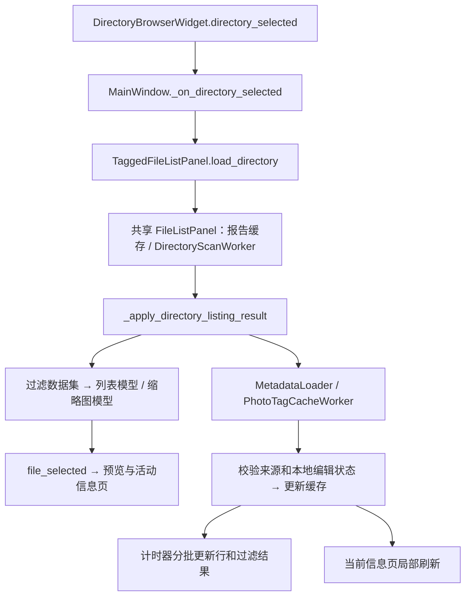

# SuperViewer 架构与代码定位

本文按运行中的数据流说明代码入口，供新增功能和排查问题时定位。行为约束以仓库 [AGENTS](../../AGENTS.md) 和 [AI_CODING_RULES](../../ai_rules/AI_CODING_RULES.md) 为准；安装与使用见 [README](../README.md)。共享浏览器、XMP 和画布位于 `app_common` 子模块，同时服务 BirdStamp，修改时需检查两端调用。

## 1. 启动与模块边界

[`main.py`](../main.py) 的 `main()` 加载运行选项与应用身份，建立支持 macOS FileOpen 的 `QApplication`，处理已有实例转发，安装主题，再创建 `MainWindow`。`SingleInstanceReceiver` 和 FileOpen 回调最终进入 `_on_received_file_list()` / `_open_received_file_list()`；普通启动恢复上次目录。窗口组装、信号接线、文件操作及关闭协调由 `MainWindow` 负责。

| 层 | 主要入口 | 职责 |
| --- | --- | --- |
| 窗口协调 | [`main.py`](../main.py)：`MainWindow` | 目录、列表、预览、信息页的连接；编辑回调、焦点任务、关闭状态 |
| 目录与列表 | [`_directory_browser.py`](../../app_common/file_browser/_directory_browser.py)、[`_panel.py`](../../app_common/file_browser/_panel.py) | 目录选择、报告范围、实际路径解析、过滤、选择、导航、剪贴板与缓存 |
| Viewer 列表扩展 | [`tagged_file_list.py`](../superviewer/tagged_file_list.py)：`SuperViewerTaggedFileListPanel` | 标签库、标签过滤/历史、异步标签缓存、Viewer 快切开关、只读缓存 provider |
| 数据模型与后台任务 | [`_models.py`](../../app_common/file_browser/_models.py)、[`_workers.py`](../../app_common/file_browser/_workers.py)、[`_thumbnail.py`](../../app_common/file_browser/_thumbnail.py) | 列表/缩略图模型，扫描、元数据、路径查找和缩略图任务 |
| 预览 | [`preview_panel.py`](../superviewer/preview_panel.py)：`PreviewPanel`；[`canvas.py`](../../app_common/preview_canvas/canvas.py)：`PreviewCanvas` | 前者决定加载策略和线程交接；后者负责缩放、平移、构图线、焦点叠加和输出 |
| 焦点 | [`focus_box_loader.py`](../superviewer/focus_box_loader.py)、[`focus_preview_loader.py`](../superviewer/focus_preview_loader.py) | 来源选择、不同格式的元数据提取、方向变换、报告保底 |
| 右侧信息页 | [`image_info_tab_widget.py`](../superviewer/image_info_tab_widget.py) 及各 `image_info_tab_*` | 活动页按需刷新；信息编辑、标签管理、异步 EXIF 表 |
| 标签模型/命令 | [`photo_tags.py`](../superviewer/photo_tags.py)、[`photo_tag_commands.py`](../superviewer/photo_tag_commands.py) | 配置树、XMP subject 读写、逐照片逆操作 |
| 元数据编辑同步 | [`metadata_edit_sync.py`](../superviewer/metadata_edit_sync.py)：`sync_saved_xmp_edit()` | EXIF 表写入成功后，将 XMP 字段映射回列表及标签缓存 |
| 主题与设置 | [`ui_theme.py`](../superviewer/ui_theme.py)、[`paths_settings.py`](../superviewer/paths_settings.py) | 系统深浅色、语义颜色、资源路径、窗口状态与上次目录 |

`image_info_tabs.py` 与共享 `_browser.py` 是兼容导出入口。新功能应定位到具体实现模块，避免往兼容文件继续堆逻辑。`main.py` 保留部分供已有脚本使用的导出；移动模块时要检查这些调用。

## 2. 目录选择到可见列表



`SuperViewerTaggedFileListPanel.load_directory()` 先切换标签配置范围、取消旧标签请求，再调用共享 `FileListPanel.load_directory()`。共享层负责复用同根报告缓存、扫描范围和取消旧任务；`_apply_directory_listing_result()` 拒绝过期目录结果，建立 `_all_files`、报告映射与视图。Viewer 在这里建立同目录同名 RAW/HEIF 的焦点来源索引。

报告模式保留整个根目录的 `_report_full_cache`，当前目录只是它的一个范围。`report.db.current_path` 可能仍指向 XMP，或照片实际已移动：[`_browser_core.py`](../../app_common/file_browser/_browser_core.py) 的报告路径规范化、范围筛选、实际路径缓存负责这种兼容。不要把原始报告路径、实际源图路径和预览 JPEG 路径合成一个可变字段，也不要回写报告修复路径。

多报告目录通过 `_build_report_scope_maps_for_files()` 按文件所属报告范围建立 `_IndexedReportCache` 路径索引；未命中的旧路径不能为每张照片重新遍历整份报告。索引随目录缓存保存和释放，保留同名照片的完整路径区分。扫描 worker 分别报告文件枚举与报告匹配进度，记录报告读取、文件枚举、报告匹配耗时，并在匹配期间响应取消。

目录切换立即启动新扫描；旧扫描取消后仍由面板持有，直到其真正的 `QThread.finished` 被处理。扫描进度和结果校验 worker 身份，排队的列表应用还校验请求代次，防止 A → B → A 时旧 A 的结果覆盖新请求。窗口关闭也等待这些扫描完成交接。

`FileTableModel` / `FileTableSortProxyModel` 和 `ThumbnailListModel` 展示同一套过滤数据。文本、评级、精选、排除、焦点及标签条件组合后重建数据集，不靠逐行隐藏控件。编号列只表示当前自然顺序。列表模式不触发缩略图工作；缩略图模式依据可见区域加载。

`MetadataLoader.metadata_batch_ready` 进入 `_on_metadata_batch_ready()` 后先更新模型缓存，再经 `_enqueue_meta_apply()` / `_apply_meta_batch_tick()` 按数量和时间预算更新行。新增字段应补齐缓存解析和模型显示，不能在结果槽里同步循环更新整目录控件。

## 3. 预览与连续快切

### 正常选择

`MainWindow._on_file_selected_from_list()` 调用 `PreviewPanel.set_image()`，然后 `on_image_loaded()` 提交当前信息路径。缩略图档位由列表的 `preview_quick_size()` 提供。

| 图像情况 | `PreviewPanel` 的加载路径 |
| --- | --- |
| 非 RAW，像素数不超过同步阈值 | `_should_load_full_preview_sync()` 判定后同步完整解码。默认阈值为 40 MP，可由 `SuperViewer_SYNC_FULL_PREVIEW_MAX_MP` 配置 |
| 大图 | 先尝试当前档位缓存或有尺寸限制的快速预览，再通过 `_full_preview_timer` 和 `_FullPreviewLoader` 替换完整图 |
| 大尺寸 HIF / HEIF / HEIC 缓存未命中 | 显示“正在加载预览”，由完整预览 worker 解码；不能为了生成临时小图在 GUI 线程完整解码 HEVC。失败后显示“无法预览” |
| RAW | 普通切换优先 `_load_raw_embedded_preview_qimage()`，使用高分辨率内嵌 JPEG；不做 RAW 解马赛克。极小 EXIF 缩略图不能抢在相机高分辨率预览前面 |

快速缓存 provider 是 `SuperViewerTaggedFileListPanel.cached_quick_preview_for_path()`：优先使用当前档位已解码的 `QPixmap`，再用共享 `_resolve_existing_sized_preview_image_path(..., exact_size_only=True)` 读取已有缓存。它不生成缓存、不返回原图冒充缩略图。缓存根和文件命名由 `_browser_core.py` 按每个源文件解析，不能简单用当前选中目录推断。

完整解码 worker 只传 `QImage` 回 GUI，GUI 转为 `QPixmap`。`_preview_request_token` 与当前路径共同拒绝晚到结果；`_full_preview_loader` 加一个 `_pending_full_preview_request` 实现单任务运行、只保留最新替换请求。原生线程退出后也必须保留引用，直到它自己的 `QThread.finished` 槽完成交接。

`full_preview_ready(path)` 通知主窗口：对仍选中的照片补充焦点请求，并调用信息页 `refresh_metadata_fields()` 补齐尺寸等字段。它不会重新加载整页、重置文件名或覆盖备注草稿。`source_pixmap_for_path()` 只暴露真正完整加载的图，避免把快速档位尺寸当作照片尺寸。

### 按住方向键

Viewer 在列表子类中启用 `enable_key_navigation_playback`、`enable_in_memory_fast_preview` 和 `skip_uncached_fast_preview`，共享浏览器默认不为所有使用者开启这套策略。

1. 第一次普通按键提交正常选择。
2. 第一次系统自动重复开始共享列表自身的播放计时器，之后按选定 FPS 推进。
3. `file_fast_preview_pixmap_requested` 直接复用已解码帧；文件路径回退走 `file_fast_preview_requested`。主窗口调用 `set_quick_pixmap()` 或 `set_image(..., load_full=False, quick_size=...)`。
4. 快切中不启动完整预览或焦点提取，不提交每帧的信息/EXIF 刷新。物理按键释放时只提交最终选择一次。

新增预览回调必须检查它是否会在播放期间触发。后台元数据和完整预览完成信号也要保留当前选择及播放状态检查，不能绕过上述规则。

## 4. 焦点来源与显示

入口为 `MainWindow._update_preview_focus_box()`。快切传入 `allow_async_load=False`，该方法在解析路径、查元数据之前就停止旧焦点任务并返回。普通预览先看开关与已缓存焦点，再创建 `FocusBoxLoader`。

`_resolve_focus_metadata_source_path()` 和列表 `focus_source_for_sibling()` 优先把预览 JPEG 对应到源 RAW/HEIF。`FocusBoxLoader` 先尝试源图，再尝试不同的预览路径；文件元数据都无法给出焦点时才使用报告中的 `focus_x/focus_y`。

[`focus_preview_loader.py`](../superviewer/focus_preview_loader.py) 的 `_load_focus_metadata_for_path()` 按 RAW、HEIF 和普通图像分别组合读取器；`_resolve_focus_calc_image_size()` 与方向变换保证焦点计算使用源尺寸和正确方向。实际相机焦点算法在共享 [`focus_calc.py`](../../app_common/focus_calc.py)。增加相机或格式支持时，优先扩展这些入口，不要在主窗口另建一条 EXIF 提取链。

主窗口持有 `_focus_loader`、最新待处理请求及显示 request id；结果可缓存到列表，但只有当前 request id 的结果能改变当前画布。

## 5. 元数据：读取、编辑与草稿

### 读取层

共享 [`photo_meta.py`](../../app_common/exif_io/photo_meta.py) 的 `PhotoMetaDataProxy` 组合原图 EXIF、只读 ReportDB 和 XMP；可编辑字段由 XMP 最后覆盖。`PhotoMetaDataProxy.write()` 统一写 XMP。[`writer.py`](../../app_common/exif_io/writer.py) 除写入工具还包含 `read_batch_metadata()` 与内存缓存；[`exiftool_runner.py`](../../app_common/exif_io/exiftool_runner.py) 管理共享 stay-open 进程及串行执行锁。

选中文件时，图片信息页使用列表注入的 `cached_photo_metadata_for_path()`，只查报告/浏览器缓存。这里不能改回同步 `PhotoMetaDataProxy.read()`：即使单张读取很快，也可能在 GUI 线程等待之前的目录批处理占用 ExifTool 锁。

后台数据到达后，`photo_metadata_cache_updated(paths)` 仅让当前活动图片信息页执行 `refresh_metadata_fields()`。它更新基本信息和已保存备注基线，保留未保存备注与文件名；文本没有变化时也保留光标和选区。标签到达另走 `photo_tags_cache_updated(paths)` 与 `refresh_photo_tags()`。

[`ImageInfoTabWidget`](../superviewer/image_info_tab_widget.py) 仅刷新活动页。非活动页更新逻辑路径并进入 `_pending_panels`，在用户打开时刷新。EXIF 页的 `_ExifRowsLoader` 在后台调用 [`exif_helpers.py`](../superviewer/exif_helpers.py) 的 `load_all_exif()`，表格配置与标签显示顺序也在该模块处理。

### 写入层

- 备注入口是 `MainWindow._save_photo_comment_from_info_panel()`；标题及 EXIF 表入口是 `_save_exif_value()`。原始照片和 RAW 不承接这些用户元数据编辑。
- 成功后必须同步显示层。`sync_saved_xmp_edit()` 只读刚保存的侧车，将 title、comment、rating、pick 和相机字段映射到列表显示字段；标签 Subject 修改另外刷新标签缓存/版本号并清理旧标签历史。
- `SuperViewerTaggedFileListPanel.sync_metadata_edit_for_path()` 将本轮目录内的编辑字段记录在 `_local_metadata_updates_by_path`，合并后续后台批次时优先采用这些字段；这避免旧备注、标题或评级覆盖刚保存的值。`load_directory()` 在目录变化或 `force_reload=True` 时清理这层保护，重新以磁盘为准。
- 清除字段也是一次明确编辑：需清理显示别名，不能因 XMP 节点被删除就留下旧缓存值。XMP 格式、命名空间、同名侧车与 XML 写入规则集中在 [`xmp_sidecar.py`](../../app_common/exif_io/xmp_sidecar.py) / `PhotoMetaDataXMP`。

通用字段由 `PhotoMetaDataXMP._write_exiftool_fields()` 在同目录临时副本中写入，收齐 ExifTool 的错误/警告后才原子提交；混合标签/标题等直接 XML 字段也随同提交。命令标签与 XML 字段名不同，例如 ISO 命令写入 `ISOSpeedRatings`，镜头使用 `Lens`。UTF-8 参数与实际读回回归见 [通用 XMP 写入测试](../../app_common/tests/test_xmp_exiftool_writes.py)。

`report.db` 只是兼容读取与补全来源。列表、元信息和焦点查询不能调用建库、schema migration 或修改 PRAGMA 的写连接。用户数据编辑不更新报告表。

## 6. 标签树、过滤与命令历史

`PhotoTagConfig.load_tree()` / `load_tree_and_tags()` 解析缩进式 `tags.cfg`，返回 `TagTreeNode` 树及去重后的叶子词表。空行和 `#` 注释被忽略，平面配置仍可用；分组只有导航作用，只有叶子会成为 XMP Subject。标签库配置优先从照片库 `.superpicky/tags.cfg` 解析，回退到应用配置。

[`tag_menu.py`](../superviewer/tag_menu.py) 的 `add_filterable_tag_actions()` 接收叶子白名单和可选完整树。搜索组名会保留该组后代；搜索叶子逐层收缩。持续勾选菜单用 `checked_provider` 在每次回调后重读真实状态，同步同名叶子和清除动作，写失败也回退勾选；关闭菜单后不会遗留无主的焦点计时任务。图片信息页的“添加标签”菜单过滤已选叶子，标签管理页使用同一扁平词表。

文本过滤由 `filter_text_tokens_match()` 实现空格分词 AND：每个词可分别命中文件名、备注或任意照片标签。`_path_matches_active_filters()` 先保留共享评级/pick/focus 等条件，再叠加文本与标签条件；`_refresh_filter_scope()` 保留递归范围和异步标签补全。


`TagStates` 是 `path → tag → bool`。`PhotoTagSidecarStore.apply_tag_states()` 在 store 的锁内逐路径严格读取完整 subjects，只改请求的标签，每路径最多写一次。未配置关键词与其他 XMP 属性保留；缺失源照片、损坏 XML、权限错误产生失败路径，不能当空标签继续覆盖。

`TagWriteResult.inverse_states` 只记录成功且实际变化的成员。例如 A 已有“飞行”、B 没有，批量添加后撤销只删除 B 的“飞行”。`RestorePhotoTagStatesCommand.execute()` 将成功逆状态与失败剩余命令交给共享 [`CommandHistory`](../../app_common/command_history.py) / `PartialCommandError`，部分失败可重试，无变化操作不会抹掉 redo。

历史归列表面板所有，最多 100 次；窗口的 [`TagHistoryActions`](../superviewer/tag_history_actions.py) 维护 QAction、图标和快捷键。`MainWindow.__init__()` 通过 `create_toolbar()` 创建固定的 `editToolBar`，与编辑菜单共用同一对动作，统一启用状态和命令入口；菜单重建不重建工具栏。在文字编辑器获焦时释放标签撤销快捷键，工具栏按钮仍操作标签历史。切换标签库、可用叶子集合变化、照片重命名或 EXIF 表直接修改 Subject 时清历史；同库切文件夹、单纯标签重排不清。历史不落盘。

异步读取由 `PhotoTagCacheWorker` 分批执行。每路径 `_photo_tag_generation_by_path` 防止读取早于本地写入的 tag/metadata 批次回退新标签；未知路径会排队补读，GUI 查询不做整批 XMP I/O。`finished_summary` 只报告逻辑进度，真正的线程释放和下一批启动必须等 `QThread.finished`。

## 7. 状态所有权、线程与关闭

| 状态/信号 | 所有者与交接 |
| --- | --- |
| 当前目录、完整/过滤文件集、报告与实际路径映射 | `FileListPanel`；扫描 worker 返回数据，不直接操作模型 |
| `_meta_cache`、元数据行更新队列 | `FileListPanel`；`metadata_batch_ready` 校验当前 sender，计时器按预算应用 |
| 标签缓存、每路径版本号、本地编辑保护、历史 | `SuperViewerTaggedFileListPanel`；写成功后更新，旧批次合并时保护 |
| `file_selected` / 两种 `file_fast_preview_*` 信号 | 列表发出，主窗口区分正常提交和播放帧 |
| 预览请求 token、完整图 worker 与最新 pending | `PreviewPanel`；`full_preview_ready` 只报告已接收的当前完整图 |
| 焦点 request id、worker 与最新 pending | `MainWindow`；`FocusBoxLoader.focus_loaded` 回传归一化框及实际使用路径 |
| 当前信息页及延迟刷新集合 | `ImageInfoTabWidget`；不活动页不主动读文件 |
| EXIF 请求 token、worker 与最新 pending | `ImageInfoTabPanel_EXIF`；`loaded` 只能更新匹配照片，当前 worker 的 `finished` 才能交接 |
| `command_history_changed` | 列表通知 `TagHistoryActions` 更新菜单状态，历史不归菜单控件 |

所有异步 UI 更新都需要“仍在当前范围/请求”检查；关闭标志之后不得补发新任务。不要用逻辑结果信号代替线程完成，也不要因为 `isRunning()` 已经为 False 就丢弃尚未处理 `finished` 的 worker 引用。

`MainWindow.closeEvent()` 首次关闭时停止导航、计时器与各面板请求，并在后台关闭 ExifTool。随后用有界等待检查焦点、信息页、完整预览及 ExifTool；仍有任务则隐藏窗口、忽略此次 close 并计时重试。只有相关任务结束后才完成列表 shutdown 和退出。超时不是完成，不能在仍有活线程时销毁父窗口。

## 8. 主题与布局扩展

`UiThemeManager` 跟随 Qt 系统色彩方案，在旧 Qt 中回退到 palette 变化；`PanelThemeColors` 提供文字、边框、背景等语义色。主窗口通过 listener 更新自身控件，信息页容器广播 `apply_theme()`，共享目录/文件列表用 [`qt_theme.py`](../../app_common/qt_theme.py) 更新本层控件。

标签筛选栏的 `changeEvent()` 先调用 `super()`，随后 `_apply_tag_filter_theme()` 原地修改现有按钮样式。信息页也复用现有标签/编辑器。主题回调不重建过滤栏、不读 XMP、不刷新筛选、不改变选择或消耗延迟页刷新；要有初始化、重入和关闭保护。

布局、输入编辑、provider 注入与状态缓存应分开。新增可编辑字段先决定保存回调与显示别名，再接控件；新增外观元素优先加语义色，不在不同页面各写一组深色常量。

## 9. 常见需求 → 修改点 → 回归

| 需求 | 入口与核心 | 优先测试 |
| --- | --- | --- |
| 目录根/子目录、报告陈旧路径 | `_panel.py.load_directory()`、`_workers.py`、`_browser_core.py` | [缓存路径](../../app_common/tests/test_file_browser_cache_paths.py)、[只读报告](../../app_common/tests/test_report_db_read_only.py) |
| 文件列表新列/过滤项 | `_models.py`、`MetadataLoader._parse_rec()`、`_path_matches_active_filters()` | [列表元数据](../../app_common/tests/test_file_browser_metadata.py)、[标签过滤](../tests/test_photo_tags.py) |
| 新图片格式或预览策略 | [image_formats.py](../../app_common/image_formats.py)、`preview_panel.py`、[thumb_stream.py](../../app_common/thumb_stream.py) | [预览策略](../tests/test_preview_panel_policy.py)、[目录响应](../tests/test_directory_selection_responsiveness.py)、[格式](../../app_common/tests/test_image_formats.py) |
| 连续浏览 FPS/缓存复用 | `_panel.py` 导航计时器、Main 的两个快切槽、`cached_quick_preview_for_path()` | [快切策略](../tests/test_fast_preview_policy.py)、[按键导航](../../app_common/tests/test_file_browser_key_navigation.py) |
| 新相机焦点或方向修正 | `focus_preview_loader.py`、`FocusBoxLoader`、`focus_calc.py` | [焦点预览](../tests/test_focus_preview_loader.py)、[焦点算法](../../app_common/tests/test_focus_calc.py) |
| 标签分组、搜索或持续菜单 | `PhotoTagConfig`、`tag_menu.py`、信息页 provider | [树菜单](../tests/test_tag_tree_menu.py)、[信息页菜单](../tests/test_image_info_tag_tree.py) |
| 批量标签、撤销/重做 | `PhotoTagSidecarStore`、`photo_tag_commands.py`、`TagHistoryActions` | [标签历史](../tests/test_photo_tag_history.py)、[菜单与工具栏](../tests/test_main_window_tag_history.py)、[快捷键与输入框](../tests/test_tag_history_actions.py)、[异步竞态](../tests/test_photo_tag_concurrency.py) |
| 备注/标题/EXIF 字段写入 | Main 保存回调、`metadata_edit_sync.py`、`PhotoMetaDataXMP` | [编辑同步](../tests/test_main_window_metadata_sync.py)、[中文与 XML 字段替换](../../app_common/tests/test_xmp_field_replacement.py) |
| 重命名/复制/剪切及侧车 | Main 重命名；共享 `_paste_clipboard_to_current_dir()` 及事务 helpers | [窗口文件操作](../tests/test_main_window_safety.py)、[剪贴板侧车](../../app_common/tests/test_file_browser_clipboard_sidecars.py) |
| 主题/布局/信息页懒加载 | `ui_theme.py`、`ImageInfoTabWidget`、各页 `apply_theme()` | [主窗口主题](../tests/test_main_window_theme.py)、[标签栏主题](../tests/test_tag_filter_theme.py)、[懒加载](../tests/test_image_info_lazy_loading.py) |
| 工作线程或关窗逻辑 | 所有者的 request/finished/shutdown 方法 | [EXIF 生命周期](../tests/test_exif_worker_lifecycle.py)、[窗口关闭](../tests/test_main_window_safety.py)、[共享关闭](../../app_common/tests/test_file_browser_shutdown.py) |

重命名会先检查源图和同目录同名 XMP 的目标冲突，支持大小写改名并在失败时回滚。剪切/覆盖使用共享文件事务；源数据或目标原文件无法完整恢复时必须保留恢复文件并报告位置。新增文件动作应复用这些路径，不能只移动图片而遗漏侧车。

## 10. 扩展与验证步骤

1. 从上表定位控件入口和状态所有者，阅读对应测试；涉及共享实现时同时检查 BirdStamp 调用。约定源图路径、显示路径、缓存路径，明确是否需要写 XMP。
2. 数据规则放在 store/helper/model；GUI 槽负责协调。长 I/O 通过已有 worker 接口扩展，增加 token/版本号和关闭检查；局部数据变动发局部信号，不整页刷新。
3. 先验证有风险的边界：缓存命中/未命中、实际路径与报告路径不一致、写失败、旧结果晚到、快速切换和关窗。标签写入还要检查已有标签与未配置 keywords 的保留。
4. 使用根 `.venv` 编译改动文件并执行对应回归；共享预览/导航变更追加 BirdStamp 对应测试。新增模块需要同步打包收集和本文定位表。

在仓库根目录，Windows PowerShell 示例：

```powershell
$env:QT_QPA_PLATFORM='offscreen'
.\.venv\Scripts\python.exe -m py_compile SuperViewer/main.py SuperViewer/superviewer/preview_panel.py
.\.venv\Scripts\python.exe -m pytest -q SuperViewer/tests
.\.venv\Scripts\python.exe -m pytest -q app_common/tests/test_file_browser_key_navigation.py app_common/tests/test_file_browser_cache_paths.py app_common/tests/test_file_browser_shutdown.py
```

macOS 使用同一根环境的 `.venv/bin/python3`。编译命令中的文件列表应换成实际改动文件；打包入口与依赖约束见根 [README](../../README.md) 和应用 [Windows spec](../SuperViewer_win.spec) / [macOS spec](../SuperViewer_mac.spec)。

Qt 测试在窗口构造前隔离 `paths_settings` 的应用/用户状态目录与共享运行选项，缓存指向临时目录；用临时图片/XMP，不对真实图库做写入 smoke。整个进程保留一个 `QApplication`，不要让 fixture 销毁后再次创建。需要完整窗口和实际事件的范例见 `test_directory_selection_responsiveness.py`、`test_main_window_theme.py`。

卡顿排查先看根 `logs/SuperViewer.log`（可通过 `APP_COMMON_LOG_FILE` 重定向）及 `perf_probe`：区分扫描、列表应用、`set_image`、信息页读取和后台批次等待。必要时使用临时只读探针或线程栈定位阻塞，再修改调度；不要先放宽等待时间或把整图解码藏进缩略图 fallback。
