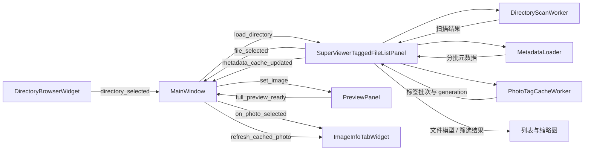

# SuperViewer 架构与开发定位

本文描述当前 `img_mgr` 应用和 `res_mgr` 共享库的实际连接方式。分支行为约束以 [AGENTS.md](../../AGENTS.md) 为准；环境和单应用构建入口见 [根目录 README](../../README.md)。修改功能时先找到下表中的入口，再追到拥有数据或线程的模块，避免直接在窗口回调中重复实现解码、侧车或文件操作。

## 启动和模块边界

`python -m SuperViewer` 经过 [__main__.py](../__main__.py) 调用 [entry.py](../entry.py) 的 `main()`；`_bootstrap_repo_root()` 只补齐 Python 导入路径。初始化虚拟环境由根级 [init_dev.py](../../init_dev.py) 完成，运行入口本身不切换解释器。

[main.py](../main.py) 的 `main()` 建立支持文件打开事件的 QApplication，处理已有实例的文件转发、应用身份和 Fusion 主题，调用 `install_ui_theme()`，再创建 `MainWindow`。`SingleInstanceReceiver` 的回调通过 Qt 定时回调交给窗口；退出时停止接收器。`MainWindow` 负责菜单、分栏、选图、接收文件和各组件生命周期，不拥有共享文件列表的底层扫描逻辑。

| 职责 | 入口与主要符号 | 边界 |
| --- | --- | --- |
| 窗口编排 | [main.py](../main.py)：`main`、`MainWindow` | 目录、文件、预览、信息页信号连接；写入入口和关闭协调 |
| 目录和通用文件浏览 | [_directory_browser.py](../../app_common/file_browser/_directory_browser.py)：`DirectoryBrowserWidget`；[_panel.py](../../app_common/file_browser/_panel.py)：`FileListPanel` | 模型、筛选、权限、剪贴板、异步元数据与缩略图 |
| Viewer 标签与本地编辑缓存 | [tagged_file_list.py](../superviewer/tagged_file_list.py)：`SuperViewerTaggedFileListPanel`、`PhotoTagCacheWorker` | 标签配置/筛选、写入历史、标签 generation、已保存字段覆盖层 |
| 标签领域与命令 | [photo_tags.py](../superviewer/photo_tags.py)：`PhotoTagConfig`、`PhotoTagSidecarStore`；[tag_commands.py](../superviewer/tag_commands.py) | 树解析、逐路径状态变更、可重试反向命令，不创建 QWidget |
| 预览与画布 | [preview_panel.py](../superviewer/preview_panel.py)：`PreviewPanel`；[canvas.py](../../app_common/preview_canvas/canvas.py)：`PreviewCanvas` | 解码请求所有权、缩放、构图线、覆盖导出 |
| 信息页 | [image_info_tab_widget.py](../superviewer/image_info_tab_widget.py)：`ImageInfoTabWidget`；[image_info_tab_base.py](../superviewer/image_info_tab_base.py)：`ImageInfoTabPanel` | 页面懒加载、同图局部刷新、主题、页面关闭 |
| 元数据适配与持久化 | [photo_meta.py](../../app_common/exif_io/photo_meta.py)：`PhotoMetaDataProxy`、`PhotoMetaDataJSON`、`PhotoMetaDataXMP` | 统一元数据键、JSON 写入、兼容读取、缓存失效 |
| 配置与主题 | [paths_settings.py](../superviewer/paths_settings.py)；[ui_theme.py](../superviewer/ui_theme.py)：`UiThemeManager` | 运行状态、资源和应用身份；语义颜色及监听 |

默认 `MainWindow` 仅向信息页容器注册 `ImageInfoTabPanel_ImageInfo` 和 `ImageInfoTabPanel_Tags`。注册动作可在 `MainWindow.__init__` 的 `add_info_panel()` 调用处定位。

## 浏览、选图和异步数据流



共享扫描和读取线程位于 [_workers.py](../../app_common/file_browser/_workers.py)：`DirectoryScanWorker`、`MetadataLoader`、`PathLookupWorker`。`FileListPanel` 将元数据批次排入 `_enqueue_meta_apply()`，再由 `_apply_meta_batch_tick()` 按数量和时间预算更新缓存/行；树与缩略图模型也分批填充。过滤由数据集重新推导，不能仅隐藏已有行造成列表和缩略图结果分叉。

Viewer 子类在基础文件筛选上加入标签与文本语义。`photo_tag_filter_matches()` 的精确模式要求全部标签，部分模式对标签子串做任一匹配；`filter_text_tokens_match()` 将文件名、备注、标签纳入文本搜索。目录递归范围仍由文件列表管理。

### 缓存范围

- 内存缩略图由 [_thumbnail.py](../../app_common/file_browser/_thumbnail.py) 的 `ThumbnailMemoryCache` 管理，视口加载由 `ThumbnailLoader` 负责；列表模式不请求缩略图。
- `PersistentThumbCacheWorker` 补齐图库缓存。[_browser_core.py](../../app_common/file_browser/_browser_core.py) 的 `_find_superpicky_dir()` 查找最近已有图库状态目录，`_persistent_thumb_cache_path_for_file()` 和 `_thumb_disk_cache_path()` 负责持久路径。
- 图库缓存位于 `.superpicky/thumb_cache/<尺寸>/`，尺寸策略通过共享 [superviewer_user_options.py](../../app_common/superviewer_user_options.py) 配置。图库外的普通磁盘缩略图使用用户缓存目录。兼容预览路径由 `_preview_cache_target_for_file()` 解析到 `.superpicky/cache/temp_preview/`。
- 切目录优先安排新视口任务，同时保留目标分支已经排队的持久缩略图工作。不要用无条件全队列清空替代现有优先级策略。

### 旧批次与本地编辑

标签读取有 worker 身份检查和逐图片 generation；早于本地写入开始的读取结果不能覆盖新标签。元数据加载器的旧批次还可能携带旧备注、评级或 Pick，因此 `SuperViewerTaggedFileListPanel.sync_metadata_edit_for_path()` 会记录成功保存的字段到 `_local_metadata_updates_by_path`。

`_merge_metadata_batch_with_photo_tag_cache()` 先按规范化路径覆盖这些本地字段，再合并当前标签缓存。只覆盖明确保存的字段，空备注、评级 `0` 和 Pick `0` 都是有效值。`load_directory()` 在切换目录或 `force_reload=True` 时清除覆盖层，使外部编辑能重新进入缓存。

当前图片信息页从 `get_photo_metadata_for_path(path, allow_slow_read=False)` 读取已有缓存。后台更新经 `MainWindow._on_metadata_cache_updated()` / `_on_full_preview_ready()` 调用 `ImageInfoTabWidget.refresh_cached_photo(path)`，不再次调用 `PreviewPanel.set_image()`。

信息页容器维护两类 pending：

| 状态 | 触发 | 激活页面时的处理 |
| --- | --- | --- |
| `_pending_panels` | 真正换图，隐藏页尚未完整刷新 | 优先执行该页完整 `refresh_ui()` |
| `_pending_metadata_panels` | 同一图片后台补齐缓存，页面隐藏 | 图片信息页只执行 `refresh_metadata_fields()` / `refresh_photo_tags()` |

当前活动页立即做相应刷新。`_refresh_cached_panel()` 对提供局部元数据接口的图片信息页调用上述方法，其他页面回退到 `refresh_current_photo()`。图片信息页的局部刷新不重设文件名和备注输入，因此保留未保存草稿。换图和 `request_shutdown()` 清理局部 pending。

## 元数据、标签与权限

### 读写适配器和侧车位置

共享 `FileListPanel` 使用 `PhotoMetaDataProxy` 聚合读取；实际合并顺序为内嵌 EXIF、XMP、JSON，后者覆盖同名键，最后规范化评级/Pick 别名。GUI 通过缓存接口获得所需字段。Viewer 标签存储默认使用 `PhotoMetaDataJSON(fallback=PhotoMetaDataXMP())`。JSON 使用 ExifTool 风格的元数据键；适配器处理 Subject、Description、Rating、Pick 的别名和类型转换。

[json_sidecar.py](../../app_common/exif_io/json_sidecar.py) 集中管理路径：

1. `find_nearest_superpicky_root()` 查找最近的图库根。
2. `json_sidecar_path_for()` 为新写入选择 `.superpicky/<sidecar-dir>/<图片相对路径>.superviewer.json`；无图库根时使用图片旁文件。
3. `json_sidecar_candidate_paths_for()` 按“集中 JSON → 旧图片旁 JSON”返回读取候选。
4. `load_superpicky_sidecar_config()` 读取 `.superpicky/config.ini` 的 `[sidecar] dir`，默认 `metadata`，只接受 `.superpicky` 内的安全相对路径。

XMP fallback 由使用该适配器的调用方显式配置。合法 JSON 已存在但没有 Subject 时，标签视为空，不把旧 XMP Subject 重新混入。严格标签读取使用 `read_subjects(strict=True)`：损坏 JSON、不可读取侧车或坏 XMP fallback 必须报错；文件不存在或合法侧车没有 Subject 才能按空集合处理。默认非严格读取接口保持兼容。

Viewer 的标签、备注和评级入口直接调用 JSON 保存。共享 `PhotoMetaDataProxy.write()` 还有通用路由：非侧车字段写内嵌 EXIF，侧车字段写 JSON，并尝试向原图镜像；不能把它与 Viewer 的直接 JSON 调用混为一条写入路径。JSON 写入保留其他字段，采用临时文件加替换。XMP 兼容实现还保留 [xmp_sidecar_edits.py](../../app_common/exif_io/xmp_sidecar_edits.py) 的协作编辑日志路径。当前 `FileListPanel.use_report_db` 默认为 `False`；`PhotoMetaDataReportDB` 和 [report_db.py](../../app_common/report_db.py) 中的读写能力仍是可用的共享兼容接口，不代表默认文件列表正在使用或修复数据库。

### 标签写入与撤销

标签词表由 `PhotoTagConfig` 加载最近 `.superpicky/tags.cfg`。`parse_tag_tree_text()` 将空格或 Tab 缩进解析为 `TagTreeNode`，分组不赋值，只有叶子进入词表。菜单构建在 [tag_menu.py](../superviewer/tag_menu.py)，界面调用文件列表的公开标签入口。

一次标签动作沿以下调用链执行：

```text
set_photo_tag_for_paths / clear_photo_tags_for_paths
  → CommandHistory.add_command
  → SetPhotoTagCommand / ClearPhotoTagsCommand
  → RestorePhotoTagStatesCommand.execute
  → SuperViewerTaggedFileListPanel._apply_photo_tag_states
  → PhotoTagSidecarStore.apply_tag_states
```

`TagStates` 表示 `{路径: {标签: 是否存在}}`。存储层在写前读取实际 Subject，合并目标成员状态，保留非配置标签；每张图片一次写入，并返回 `TagWriteResult(inverse_states, failed_paths, current_tags)`。不存在的原图不生成孤儿 JSON。

[command_history.py](../../app_common/command_history.py) 的 `Command.execute()` 返回反向命令或 `None`。`None` 表示没有实际改变，不清空 redo。`PartialCommandError(inverse, remaining)` 分开表达已经完成的逆操作和仍需重试的部分：新动作仅将成功改变放入 undo；撤销/重做失败的子集保留在原栈待重试，成功部分放入对侧栈。两个栈默认各限 100 条。通用 `BatchCommand` 按 LIFO 执行并保留失败后的安全重试顺序。

历史当前用于标签，不自动涵盖备注、评级或文件移动。加入新的可撤销功能时，应扩展命令适配，不把“不成功”或“不改变”伪装成成功的反向命令。

### 写权限路由

权限基础在 [_permissions.py](../../app_common/file_browser/_permissions.py)，目录加载刷新图库与侧车写权限。当前路由存在明确差异：

| 操作 | 常用入口 | 检查 |
| --- | --- | --- |
| 备注 | `MainWindow._save_photo_comment_from_info_panel()` | 文件写权限，然后 JSON 保存及缓存同步 |
| 重命名 / 文件移动回收 | `MainWindow._rename_photo_from_info_panel()` / `FileListPanel` 对应文件操作 | 文件写权限和具体文件限制 |
| 标签 / undo / redo | `SuperViewerTaggedFileListPanel` 公开方法 | 侧车写权限 |
| 评级 / Pick | `FileListPanel` 评级入口及 Viewer 覆盖的 JSON 写路径 | 侧车写权限 |

共享 `_rating_writes_allowed()` 动态调用 `self.rating_writes_allowed()`；Viewer 子类覆盖该方法并返回 `sidecar_writes_allowed()`，因此公开评级/Pick 入口也使用侧车权限，JSON 保存路径再次检查同一权限。保留这些现有调用路由，不能绕过公开入口，也不要因某项写入被禁用而停止复制、预览、定位和筛选。

## 预览策略和线程所有权

`PreviewPanel.set_image(path, *, load_full=True, quick_size=None)` 是已选图片的入口。源图片路径、用于快显的缓存图片和导出源像素是三个不同概念；元数据、EXIF 和文件动作始终使用源路径语义。

| 场景 | 路径 | 关键约束 |
| --- | --- | --- |
| 普通选图，可快速取得尺寸 | `_try_set_direct_original_preview()` | 仅已知像素数不超过 `_DIRECT_ORIGINAL_PREVIEW_MAX_PIXELS = 40 * 1024 * 1024`，且没有旧 full-preview worker 所有权时可直接同步加载 |
| 大图 / 尺寸未知 | `_load_quick_preview_pixmap()` → 延迟启动 full loader | 优先已有磁盘缩略图，再由后台解码；同图快显转为正式选中仍要补齐 |
| HEIF 快速预览缓存未命中 | `_load_quick_preview_pixmap()` 返回空 | 不在这个分支调用 Pillow 缩略图生成；正式选图等待后台，连续按键不启动整图解码 |
| RAW 普通显示 | `_load_full_preview_qimage_raw()` | 内嵌预览优先，失败后半尺寸 demosaic，保持方向处理 |
| 覆盖层原图导出 | `_ensure_full_preview_loaded_sync()` | 等待当前显示解码退出，RAW 使用完整源分辨率；失败不拿快显替代 |

HEIF 的直接原图分支仍受普通选图阈值规则约束，不能把“快速缓存未命中保护”理解成所有 HEIF 都异步。RAW 的显示就绪标志和 `_canvas_source_full_resolution` 分开；缩放显示成功不等于已具备完整导出像素。

`_start_full_preview_loader()` 只保留最新 pending 请求，`_launch_full_preview_loader()` 建立当前线程所有权。路径、request token 和关闭状态共同过滤结果；`_cleanup_full_preview_loader()` 只清除同一线程，并在真实 `finished` 清理后交接最新 pending。即使旧线程已不在运行但其清理信号还排队，也不能启动第二个解码器或让旧回调清掉新线程。

导出通过 `render_source_pixmap_with_overlays()` / `save_source_pixmap_with_overlays()` 取得完整源像素并调用共享画布绘制覆盖层；需要先排空已有解码，超时则失败。连续方向键由文件列表的 key-navigation 流程管理，快显阶段使用 `load_full=False` 或 `set_quick_pixmap()`，释放/正式提交后再补齐。

### 未挂载模块

[image_info_tab_exif.py](../superviewer/image_info_tab_exif.py)、[exif_table.py](../superviewer/exif_table.py)、[exif_tag_order_dialog.py](../superviewer/exif_tag_order_dialog.py) 保留 EXIF 页和配置能力，但默认窗口没有注册 EXIF 页。

[focus_box_loader.py](../superviewer/focus_box_loader.py) 的 `FocusBoxLoader` 和 [focus_cache_preload_worker.py](../superviewer/focus_cache_preload_worker.py) 的 `FocusCachePreloadWorker` 是专用焦点线程模块，当前 `MainWindow` 未实例化它们。[focus_preview_loader.py](../superviewer/focus_preview_loader.py) 的通用 helper 和 `main.py` 的兼容导出仍存在；不能据此描述默认窗口有一条单独的焦点预加载服务。

## 配置、主题和关闭

[paths_settings.py](../superviewer/paths_settings.py) 区分程序资源与可写状态：`_get_config_path()` 定位运行程序目录的 `super_viewer.cfg`，打包资源读取另走 `_get_config_resource_path()`；`load_last_folder_from_file()` 优先读取用户状态目录的 `last_selected_directory.txt`，再兼容旧程序目录文件。Windows 用户状态在 `%APPDATA%/SuperViewer`，macOS 在 `~/Library/Application Support/SuperViewer`。分栏和目录等设置由对应 `load_*` / `save_*` 接口读写。共享运行选项位于 [superviewer_user_options.py](../../app_common/superviewer_user_options.py)，图库侧车配置与用户界面配置不是同一文件。

`UiThemeManager` 统一语义颜色并通知已连接页面。`apply_theme()` 只重设样式；图片选择或 `refresh_ui()` 才负责读取/重建相应状态，主题切换不应重新解码或覆盖编辑草稿。

`MainWindow.closeEvent()` 先锁定关闭状态、停止键盘快显并向信息页、预览和文件列表发 `request_shutdown()`，再分别做有界 `shutdown(wait_timeout_ms=25)`。未全部完成时隐藏窗口并通过定时器重试，保留线程持有者；完成后保存分栏并接受关闭。组件自身负责停止计时器、解除监听、保留在退出中的线程，并由创建线程池的 worker 收束其 executor，不能靠销毁 QWidget 终止后台 I/O。

日志经 [app_common/log.py](../../app_common/log.py) 的 `get_logger()` 输出；根启动脚本设置默认 `APP_COMMON_LOG_FILE=logs/SuperViewer.log`。诊断异步问题时记录源路径、请求/线程身份、缓存命中、已选目录和关闭状态，比仅增加等待时间更有用。

## 按功能定位与回归

表中测试都相对于当前仓库，可单独传给 pytest；不要借用另一份工作区的环境。

| 要修改的功能 | 先查入口 / 核心 | 相关测试 |
| --- | --- | --- |
| 新图片格式、首帧、RAW 完整导出 | `PreviewPanel`、共享 [thumb_stream.py](../../app_common/thumb_stream.py) 和格式 helper | [test_preview_panel_policy.py](../tests/test_preview_panel_policy.py)、[test_heif_preview_responsiveness.py](../tests/test_heif_preview_responsiveness.py)、[test_thumb_stream_raw_preview.py](../../app_common/tests/test_thumb_stream_raw_preview.py)、[test_image_formats.py](../../app_common/tests/test_image_formats.py) |
| 元数据字段、同图后台补齐、编辑后旧批次 | `MainWindow` 编辑回调、`sync_metadata_edit_for_path()`、`refresh_cached_photo()` | [test_metadata_edit_cache_sync.py](../tests/test_metadata_edit_cache_sync.py)、[test_info_background_refresh.py](../tests/test_info_background_refresh.py)、[test_preview_info_sync.py](../tests/test_preview_info_sync.py)、[test_image_info_metadata.py](../tests/test_image_info_metadata.py) |
| 信息页、新标签页或主题样式 | `ImageInfoTabWidget`、`ImageInfoTabPanel`、`UiThemeManager` | [test_image_info_lazy_loading.py](../tests/test_image_info_lazy_loading.py)、[test_image_info_theme.py](../tests/test_image_info_theme.py)、[test_directory_browser_theme.py](../../app_common/tests/test_directory_browser_theme.py) |
| 标签语法、筛选、撤销 | `PhotoTagConfig`、`PhotoTagSidecarStore`、`RestorePhotoTagStatesCommand` | [test_photo_tags.py](../tests/test_photo_tags.py)、[test_photo_tag_history.py](../tests/test_photo_tag_history.py)、[test_tag_undo_redo.py](../tests/test_tag_undo_redo.py)、[test_command_history.py](../../app_common/tests/test_command_history.py) |
| JSON / XMP fallback 和写前校验 | `PhotoMetaDataJSON`、`PhotoMetaDataXMP`、JSON 路径 helper | [test_json_sidecar.py](../../app_common/tests/test_json_sidecar.py)、[test_tag_subjects_strict.py](../../app_common/tests/test_tag_subjects_strict.py)、[test_photo_meta_proxy.py](../../app_common/tests/test_photo_meta_proxy.py) |
| 复制、剪切、回收、权限 | `FileListPanel` 剪贴板入口、共享 [file_utils.py](../../app_common/file_utils.py) | [test_file_browser_paste_transaction.py](../../app_common/tests/test_file_browser_paste_transaction.py)、[test_file_browser_clipboard_sidecars.py](../../app_common/tests/test_file_browser_clipboard_sidecars.py)、[test_file_browser_permissions.py](../../app_common/tests/test_file_browser_permissions.py)、[test_file_utils.py](../../app_common/tests/test_file_utils.py) |
| 缓存范围、元数据批次、导航或关闭 | `FileListPanel`、`MetadataLoader`、`ThumbnailMemoryCache` | [test_file_browser_cache_paths.py](../../app_common/tests/test_file_browser_cache_paths.py)、[test_file_browser_metadata_batching.py](../../app_common/tests/test_file_browser_metadata_batching.py)、[test_file_browser_key_navigation.py](../../app_common/tests/test_file_browser_key_navigation.py)、[test_file_browser_shutdown.py](../../app_common/tests/test_file_browser_shutdown.py)、[test_thumbnail_memory_cache.py](../../app_common/tests/test_thumbnail_memory_cache.py) |

文件粘贴的安全边界位于 `FileListPanel._paste_clipboard_to_current_dir()`：解析 `_clipboard_file_payload()` 后，通过 `_unique_paste_destinations()` 为整个 payload 保留目标路径，再交给 `_paste_path_pairs_transaction()`。自定义剪贴板声明的成员即使已经消失也必须保留到验证阶段，避免部分源文件被静默排除后继续剪切。

`_publish_paste_file_without_overwrite()` 在 Windows 使用无覆盖 rename，其他平台优先 link，不能链接时使用独占创建复制；最终发布再次拒绝覆盖并发文件。同一 RAW/JPEG 共享的 XMP 可以出现在多个目标组：源文件只移动一次，其余目标从已保留副本复制。任一阶段失败会回滚整个批次；恢复失败保留完整副本并向用户报告路径。这一机制保障可处理异常下的恢复，不承诺跨文件或崩溃原子性。

### 扩展步骤

1. **加格式或解码策略**：先扩展共享格式/缩略图入口，再决定普通显示和完整导出各自需要的精度。验证快速导航、方向、HEIF 缓存未命中、RAW 内嵌预览和失败导出，不把全解码加到热路径。
2. **加元数据字段**：在适配器规范别名与值类型，再接权限受控写入口。保存成功后按路径同步缓存并记录需要覆盖旧批次的字段，信息页用局部刷新呈现，最后验证中文实际侧车读回及空值。
3. **加标签命令**：复用逐路径 `TagStates` 和 `TagWriteResult`，为成功部分生成真实 inverse；验证混合初始状态、no-op、部分失败及失败重试，不覆盖非配置 Subject。
4. **加信息页**：实现 `ImageInfoTabPanel` 并在 `MainWindow` 显式注册。区分完整换图刷新、同图缓存局部刷新和纯主题重设，接入 `request_shutdown()` / `shutdown()`，隐藏页不要主动重复慢读。
5. **改文件操作**：先确认源图片与所有侧车解析，再修改整批计划和无覆盖发布。真实临时文件测试必须覆盖共享 XMP、目标竞争、跨卷/不能硬链接、移动失败和恢复失败路径。

## 运行验证

在仓库根目录使用当前 `.venv`，先编译改动文件并运行表中专项，再运行相关完整目录：

```powershell
.\.venv\Scripts\python.exe -m py_compile <改动的Python文件>
$env:QT_QPA_PLATFORM = 'offscreen'
.\.venv\Scripts\python.exe -m pytest app_common/tests SuperViewer/tests -q
```

macOS 使用 `.venv/bin/python3` 和同一组 pytest 参数。GUI 测试在创建窗口前把 `paths_settings` 读写入口、上次目录、用户选项、权限和相关缓存隔离到临时目录；不要读取真实图库后再清理用户配置。已有 MainWindow 测试可作为隔离模板。持有 QApplication 引用，按真正的异步完成条件做有界等待，并在测试退出时关闭线程。

改变写入必须使用真实临时图片及中文 JSON/XMP 做写后读回；改变打包还需运行产物启动验证。离屏 Qt 测试和 `py_compile` 无法替代实际 Windows/macOS 打包验证。
