# 鸟清晰度计算流程图

本文按代码的实际执行顺序，用流程图说明一张照片从入队到写入 XMP 的每个环节。算法的背景、标定数据和取舍理由见 [bird_sharpness.md](bird_sharpness.md)；本文只讲“先做什么、再做什么、什么条件走哪条分支”。所有阈值都标注了代码位置，以代码为准。

版本：`sbt-blur-v14`（[scoring.py](../bird_sharpness/scoring.py) `ALGORITHM_VERSION`），非默认参数会追加后缀（见文末）。

## 目录

1. [总流程](#1-总流程)
2. [入口与任务调度](#2-入口与任务调度)
3. [解码全分辨率图像](#3-解码全分辨率图像)
4. [鸟体识别：首遍、鸟群补检、去重与限数](#4-鸟体识别首遍鸟群补检去重与限数)
5. [无鸟复检：提亮、1024 px、焦点处弱候选与放大](#5-无鸟复检提亮1024-px焦点处弱候选与放大)
6. [增强找鸟（可选）](#6-增强找鸟可选)
7. [逐只鸟测量](#7-逐只鸟测量)
8. [排除假鸟 / 局部，取最好的一只](#8-排除假鸟--局部取最好的一只)
9. [无鸟时的区域测量：焦点 → 手动对焦焦平面 → 全图](#9-无鸟时的区域测量焦点--手动对焦焦平面--全图)
10. [边缘模糊半径 σ 的估计（所有区域共用）](#10-边缘模糊半径-σ-的估计所有区域共用)
11. [判定与打分](#11-判定与打分)
12. [写入 XMP sidecar](#12-写入-xmp-sidecar)
13. [参数、版本后缀与关键阈值速查](#13-参数版本后缀与关键阈值速查)

---

## 1. 总流程

一张照片 = 一个 `BirdSharpnessAction`（[actions.py](../bird_sharpness/actions.py)），核心在 `BirdSharpnessAnalyzer._analyze()`（[analyzer.py](../bird_sharpness/analyzer.py)）。

例外：计算过程窗口里模型链的「测清晰度」传入 `given`（`GivenBirds`，临时图上的给定鸟）时走 `_analyze_given()`：① 用传入的临时图（不解码）→ 直接 ⑤ 逐只鸟测量 → ⑥ 排除 → 取最好的一只；跳过 ②–④ 的识别、复检、增强找鸟和 ⑦ 无鸟分块，也不读焦点框（临时图不是相机画幅）。临时图（`preview.analysis_input()`）是原图在这些鸟周围外扩 `ANALYSIS_MARGIN` 的一块像素；按钮箭头可选「涂灰抠图（对比用）」（`fill=True`，`GivenBirds.filled`）：鸟以外的 `rgb8` 涂成 `MASK_FILL`、测量用灰度涂成 `MASK_FILL_GRAY`，灰色与轮廓之间的人工锐利边缘在测量区域碰到轮廓时会被测进去，结果可能偏锐。见 [鸟清晰度检测](bird_sharpness.md) 的「测清晰度」。

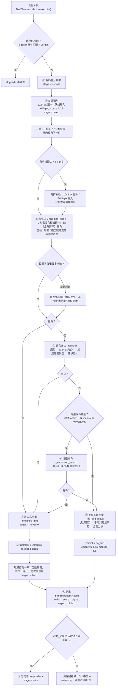

进度窗口显示的 4 个阶段即 `decode → detect → measure → write`（`check` 是写入前的版本检查，`queued` 为排队）。

---

## 2. 入口与任务调度

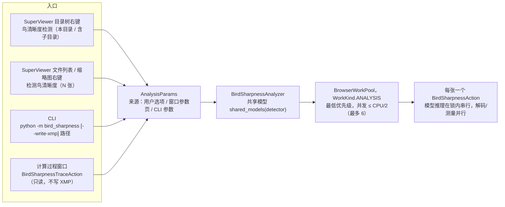

- 三处入口共用同一套 `AnalysisParams`（[params.py](../bird_sharpness/params.py)），只是来源不同。默认值下结果和版本号不变。
- 模型推理（YOLO / 关键点 / SAM）在 `BirdSharpnessModels` 的锁内串行执行，RAW 解码、预处理和 σ 计算并行。

---

## 3. 解码全分辨率图像

代码：[image_source.py](../bird_sharpness/image_source.py) `load_analysis_image()`。

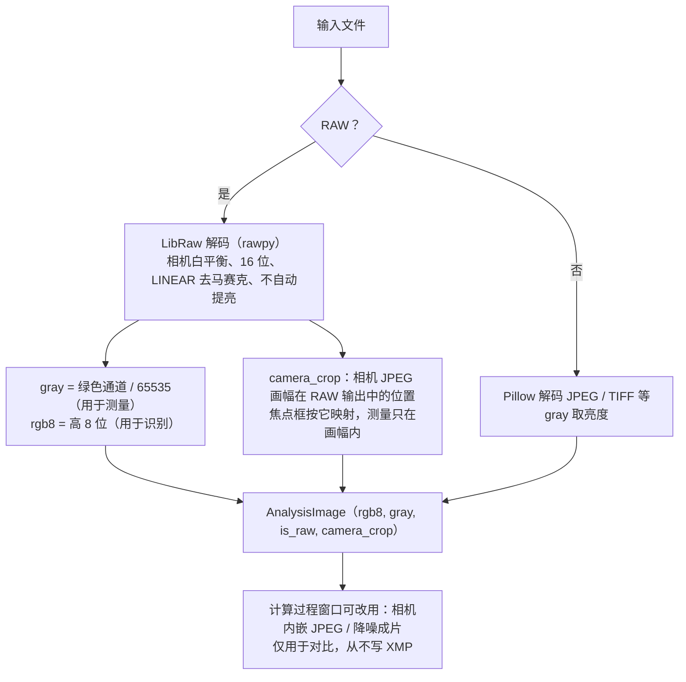

要点：不使用 RAW 内嵌预览（机内锐化、降噪和 8 位压缩会改变边缘宽度）。`valid_bounds()` 按 `camera_crop` 裁掉 RAW 输出的黑边，否则黑边的硬边界会被测成“清晰”。

---

## 4. 鸟体识别：首遍、鸟群补检、去重与限数

代码：`_analyze()`、`dedupe_detections()`、`_small_bird_pass()`、`prefer_focus_birds()`、`_limit()`。

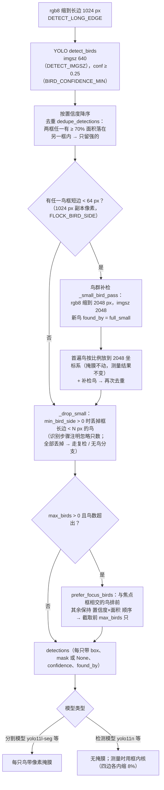

- 检测模型由 `AnalysisParams.detector` 决定（`auto` = 内置选择：分割模型优先）。
- 首遍网络输入保持 640 px 不变：这样有鸟的照片结果不随新增逻辑改变。

---

## 5. 无鸟复检：提亮、1024 px、焦点处弱候选与放大

代码：`_recheck()`。仅在首遍（含鸟群补检）没有鸟时执行。

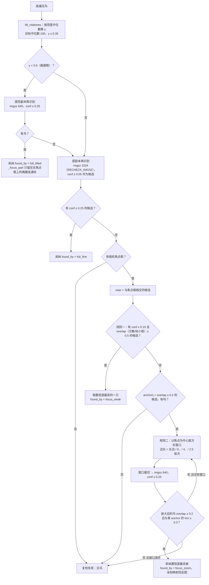

- 提亮图只用于识别，测量永远用原始像素。
- 单凭放大结果不采信（放大后的暗叶子常被认成 0.3–0.8 的“鸟”），必须与一个弱候选位置一致。
- SuperViewer 预览“显示鸟体”首遍无鸟时调用同一函数（`find_missed_bird()`）。

---

## 6. 增强找鸟（可选）

代码：`_enhanced_search()`，参数 `AnalysisParams.enhanced`（默认关闭）。触发条件：复检后仍无鸟，且模式为 `nobird`，或模式为 `manual` 且照片为手动对焦。

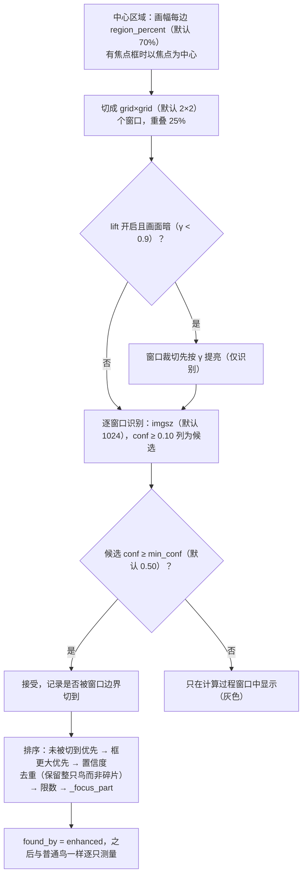

---

## 7. 逐只鸟测量

代码：`_measure_bird()`，每只鸟独立得到一组 `BirdMeasurement`。

### 7.1 取该鸟的像素

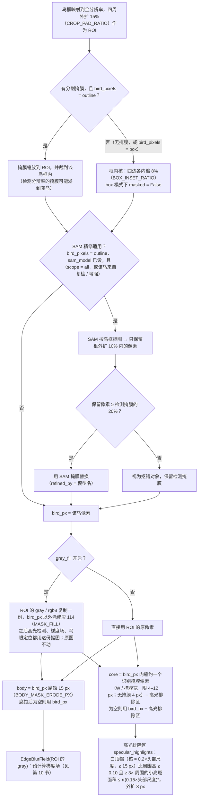

- 头部尺度 = max(40 px, 15% × 鸟框长边)，与关键点无关，先于头部定位算出。
- `bird_pixels` / `grey_fill`（`AnalysisParams`，设置 / 参数页 / CLI `--pixels` `--grey-fill`）：「整个鸟框区域」忽略分割与 SAM 轮廓、只测框内核；「鸟以外涂灰再测量」复刻模型链「抠出像素 + 涂灰」：SAM 在涂灰前用原图像素抠图，涂灰后的裁切交给第 7.2–7.4 节的全部测量和鸟眼定位（`locate_head` 看到的是抠图）。灰与轮廓之间的人工锐利边缘因 core / body 都向内收而通常测不到。非默认值记入版本后缀 `-box` / `-grey`。
- 为什么内缩而不是外扩：掩膜来自 1024 px 识别副本，轮廓有约一个掩膜像素的误差；原来外扩 9 px 时，轮廓上的背景树皮裂缝会成为头部“最强边缘”（DSC06285：38 个头部测点里 13 个在树皮上）。内缩会丢掉鸟的轮廓边缘，头内的羽毛、眼、喙仍在。
- 为什么排除高光：脱焦的点光源不是高斯模糊，而是硬边的光斑（bokeh 圆），阶跃边缘估计会把它的边缘测成 0.3–0.9 px。DSC06285 整只鸟脱焦（羽毛 2.2–2.7 px），眼睛里 7 px 的高光提供了 38 个头部测点中的 16 个，头部中位数 0.70 判成“清晰”；排除后头部 2.75，判“模糊”。

### 7.2 身体 σ 与运动模糊方向比

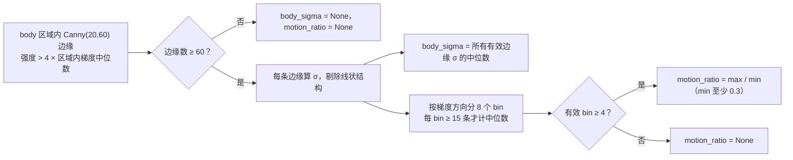

### 7.3 头部定位（关键点 + 镜像复核）

代码：`locate_head()`。

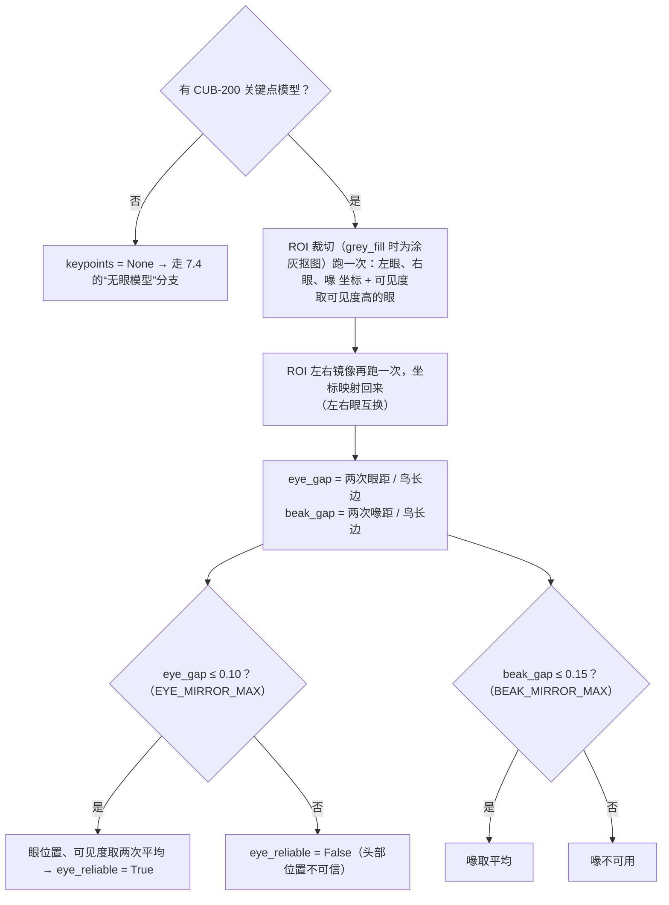

### 7.4 头部 σ 与该鸟的判定

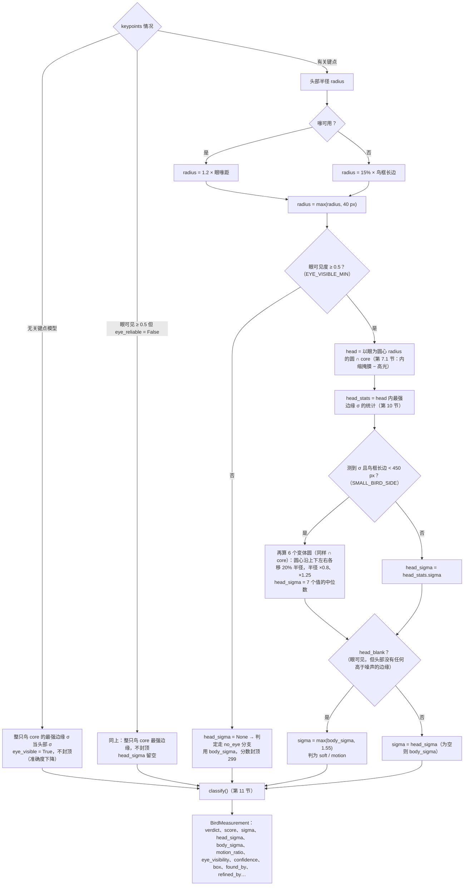

---

## 8. 排除假鸟 / 局部，取最好的一只

代码：`excluded_birds()`、`BirdMeasurement.rank()`、`_bird_result()`。只有 ≥ 2 只鸟时才排除；没有关键点模型时（无可见度）不排除。

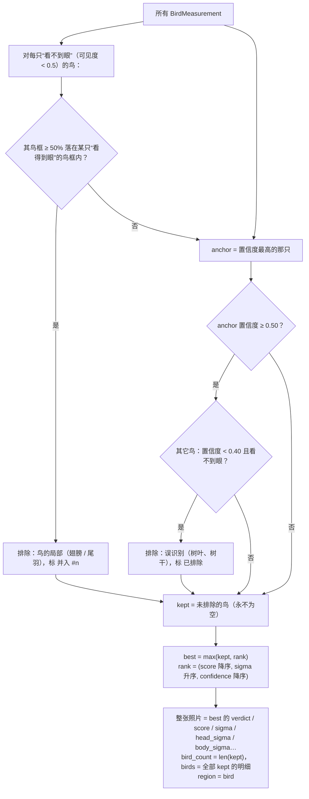

---

## 9. 无鸟时的区域测量：焦点 → 手动对焦焦平面 → 全图

代码：`_no_bird_result()`、[focus.py](../bird_sharpness/focus.py)、[metrics.py](../bird_sharpness/metrics.py) 的 `sharpest_tiles_blur()` / `full_image_blur()`。

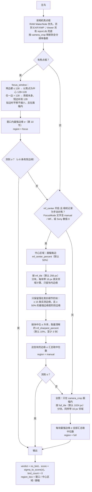

- 手动对焦为什么“取最清晰的块”而不是“全部取中位数”：前景虚化和背景占多数分块，中位数会偏低；焦平面只是画面里最清晰的那一小部分。
- 中心区域没有可测分块时退回全图。

---

## 10. 边缘模糊半径 σ 的估计（所有区域共用）

代码：[metrics.py](../bird_sharpness/metrics.py) `EdgeBlurField`。头部、整鸟、焦点窗口、分块都调用 `select_strongest_edges()`；身体用 `body_blur_detail()`（门槛略不同，见 7.2）。

### 10.1 预计算（每个 ROI 一次）

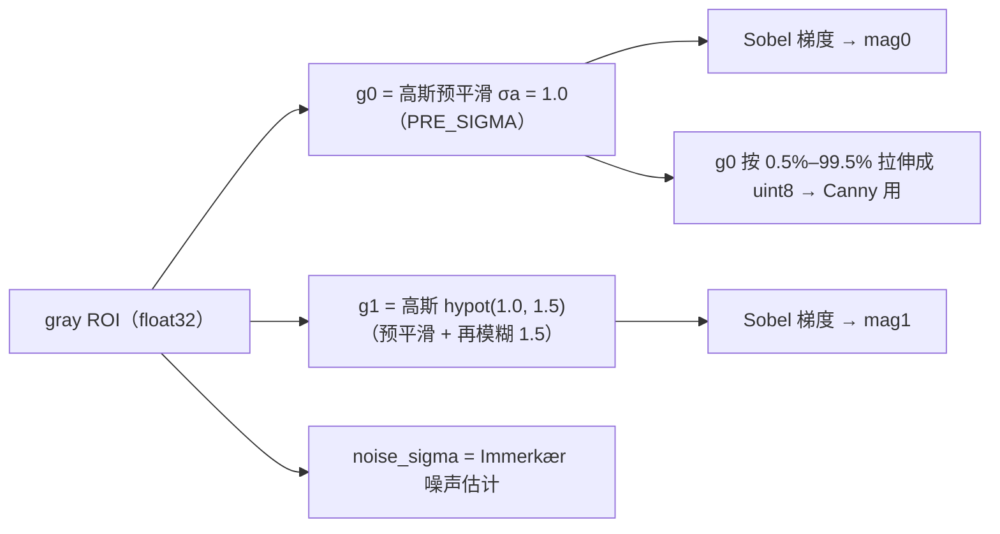

### 10.2 单次区域查询 `select_strongest_edges(region)`

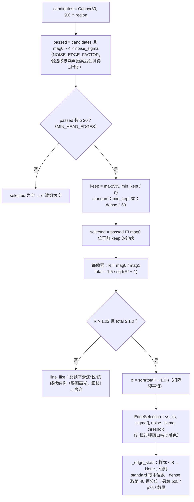

原理：Zhuo & Sim (2011) 梯度再模糊比值法。σ 与对比度、曝光、羽色无关。像素采样与 Sobel 差分带来约 0.6–0.73 px 的固有下限，阈值已按实测值标定。

---

## 11. 判定与打分

代码：[scoring.py](../bird_sharpness/scoring.py) `classify()`、`sigma_to_score()`。

### 11.1 verdict

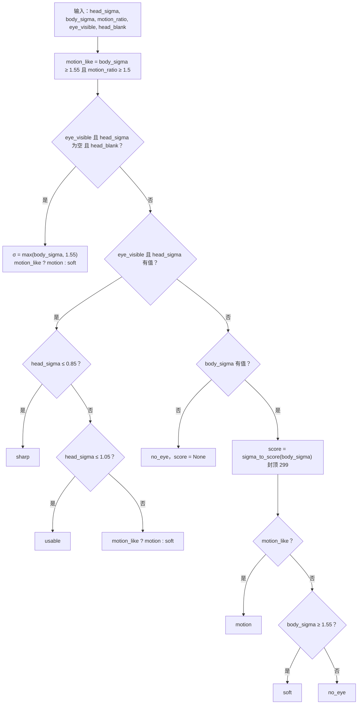

无鸟时不经过 `classify()`，verdict 固定为 `no_bird`，分数由区域 σ 直接映射。

### 11.2 σ → 0–1000 分（分段线性，SuperPicky 刻度）

| σ (px) | 分数 | 含义 |
| --- | --- | --- |
| ≤ 0.50 | 1000 | |
| 0.85 | 500 | 清晰门槛 |
| 1.05 | 300 | 可用门槛（SuperPicky 三星线） |
| 1.55 | 100 | 明显模糊（SuperPicky 判废线） |
| ≥ 2.55 | 0 | |

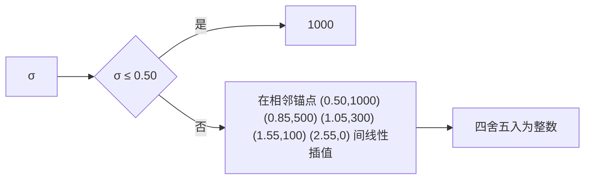

---

## 12. 写入 XMP sidecar

代码：[xmp_store.py](../bird_sharpness/xmp_store.py)、`BirdSharpnessResult.to_xmp_fields()`、字段名 [app_common/bird_sharpness_fields.py](../app_common/bird_sharpness_fields.py)。

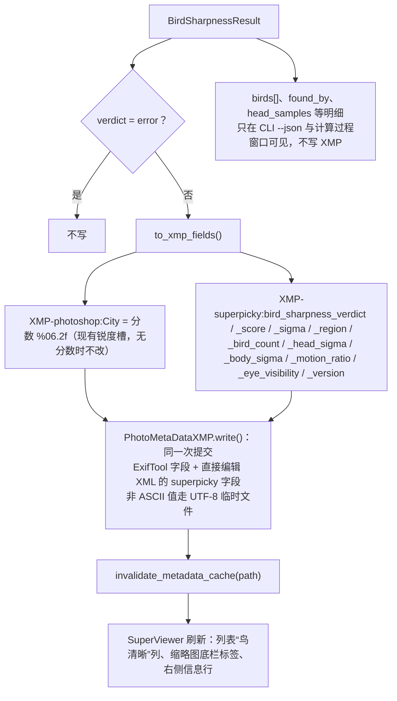

“跳过已检测”在任务开头比较 sidecar 里的 `bird_sharpness_version` 与当前版本（含参数后缀），相同才跳过。

---

## 13. 参数、版本后缀与关键阈值速查

### 可调参数（`AnalysisParams`，三处入口共用）

| 参数 | 默认 | 影响环节 | 版本后缀 |
| --- | --- | --- | --- |
| `max_birds` | 0（不限） | 第 4 节限数 | 无 |
| `edge_estimator` | standard | 第 10 节 min_kept / 分位 | `-dense` |
| `detector` | auto | 第 4、5、6 节识别模型 | `-<模型名>` |
| `sam_model` / `sam_scope` | 空 / all | 第 7.1 节掩膜精修：设了 SAM 模型时每只检测到的鸟都经 SAM 抠一次；rechecked = 只有复检 / 增强找到的鸟 | `-<sam名>-all` / `-rechecked` |
| `min_bird_side` | 0（不忽略） | 第 4–6 节：丢掉框长边 < N px 的鸟 | `-min<N>` |
| `bird_pixels` | outline | 第 7.1 节：轮廓内 / 整个鸟框内核（box 时不做 SAM） | `-box` |
| `grey_fill` | False | 第 7.1 节：鸟以外涂灰 114 后再测（含鸟眼定位） | `-grey` |
| `enhanced.*` | off | 第 6 节 | `-enh-<mode><region>g<grid>i<imgsz>c<conf>[-nolift]` |
| `tiles.full_tile` | 1024 | 第 9 节全图分块 | `-t<n>` |
| `tiles.mf_center` / `mf_center_percent` / `mf_tile` / `mf_sharpest_percent` | True / 50 / 256 / 10 | 第 9 节手动对焦 | `-mf<pct>-<tile>-<sharp>` 或 `-mf-off` |

### 固定阈值（代码常量）

| 常量 | 值 | 位置 | 用途 |
| --- | --- | --- | --- |
| `DETECT_LONG_EDGE` / `DETECT_IMGSZ` | 1024 / 640 | analyzer.py | 首遍识别 |
| `BIRD_CONFIDENCE_MIN` | 0.25 | models.py | 采纳为鸟的置信度 |
| `DUPLICATE_CONTAINMENT` | 0.70 | analyzer.py | 去重 |
| `FLOCK_BIRD_SIDE` / `SMALL_DETECT_LONG_EDGE` | 64 / 2048 | analyzer.py | 鸟群补检触发与分辨率 |
| `LIFT_MEDIAN_TARGET` / `LIFT_GAMMA_MIN` / `LIFT_DARK_GAMMA` | 100 / 0.35 / 0.9 | analyzer.py | 暗部提亮 |
| `RECHECK_IMGSZ` | 1024 | analyzer.py | 复检网络输入 |
| `FOCUS_WEAK_CONFIDENCE` / `FOCUS_WEAK_OVERLAP` | 0.10 / 0.5 | analyzer.py | 复检规则一 |
| `FOCUS_ZOOM_DIVISORS` / `FOCUS_ZOOM_OVERLAP` / `FOCUS_ZOOM_AGREEMENT_IOU` | (6, 4, 2.5) / 0.2 / 0.3 | analyzer.py | 复检规则二 |
| `ENH_CANDIDATE_CONFIDENCE` / `ENH_WINDOW_OVERLAP` | 0.10 / 0.25 | analyzer.py | 增强找鸟 |
| `CROP_PAD_RATIO` / `BOX_INSET_RATIO` | 0.15 / 0.08 | analyzer.py | ROI 外扩 / 框内核 |
| `ANALYSIS_MARGIN` | 0.3 | preview.py | 测清晰度临时图：给定鸟范围每边外扩 |
| `MASK_FILL` / `MASK_FILL_GRAY` | 114 / 114÷255 | preview.py | 涂灰抠图（及模型链抠图）的灰色：rgb8 / 测量灰度 |
| `MIN_KEEP_FRACTION` | 0.2 | refine.py | SAM 掩膜可信下限 |
| `EYE_VISIBLE_MIN` / `BEAK_VISIBLE_MIN` | 0.5 / 0.3 | analyzer.py | 关键点可见度 |
| `EYE_MIRROR_MAX` / `BEAK_MIRROR_MAX` | 0.10 / 0.15 | analyzer.py | 镜像复核 |
| `HEAD_RADIUS_BEAK_RATIO` / `HEAD_RADIUS_BOX_RATIO` / `HEAD_RADIUS_MIN_PX` | 1.2 / 0.15 / 40 | analyzer.py | 头部半径 |
| `SMALL_BIRD_SIDE` / `HEAD_SAMPLE_SHIFT` | 450 / 0.2 | analyzer.py | 小鸟 7 圆中位数 |
| `HEAD_MASK_ERODE_MIN_PX` / `HEAD_MASK_ERODE_MAX_PX` / `BODY_MASK_ERODE_PX` | 4 / 12 / 15 | analyzer.py | 头部掩膜内缩（约一个识别掩膜像素）/ 身体掩膜 |
| `HIGHLIGHT_MIN_RISE` / `HIGHLIGHT_CONTRAST` / `HIGHLIGHT_KERNEL_RATIO` / `HIGHLIGHT_MAX_RADIUS_RATIO` / `HIGHLIGHT_MARGIN_PX` | 0.10 / 3.0 / 0.2 / 0.15 / 8 | metrics.py | 高光（眼睛反光）排除 |
| `EXTRA_BIRD_CONFIDENCE_MAX` / `EXTRA_BIRD_ANCHOR_MIN` / `PART_OF_BIRD_OVERLAP` | 0.4 / 0.5 / 0.5 | analyzer.py | 排除假鸟 / 局部 |
| `PRE_SIGMA` / `REBLUR_SIGMA` | 1.0 / 1.5 | metrics.py | 再模糊比值法 |
| `NOISE_EDGE_FACTOR` | 4.0 | metrics.py | 边缘信噪门槛 |
| `MIN_HEAD_EDGES` / `MIN_BODY_EDGES` | 20 / 60 | metrics.py | 最少边缘数 |
| `DIRECTION_BINS` / `MIN_EDGES_PER_DIRECTION` | 8 / 15 | metrics.py | 运动模糊方向统计 |
| `FOCUS_MIN_SIDE` | 128 | focus.py | 焦点窗口 |
| `TILE_MARGIN` / `MF_MIN_TILES` / `MF_TILE_MIN_EDGES` / `MF_TILE_MIN_STEP_FRACTION` | 16 / 3 / 15 / 0.5 | metrics.py | 分块 |
| `SIGMA_SHARP_MAX` / `SIGMA_USABLE_MAX` / `SIGMA_BLURRED_MIN` | 0.85 / 1.05 / 1.55 | scoring.py | 判定门槛 |
| `MOTION_RATIO_MIN` / `NO_EYE_SCORE_CAP` | 1.5 / 299 | scoring.py | 运动模糊 / 无眼封顶 |
